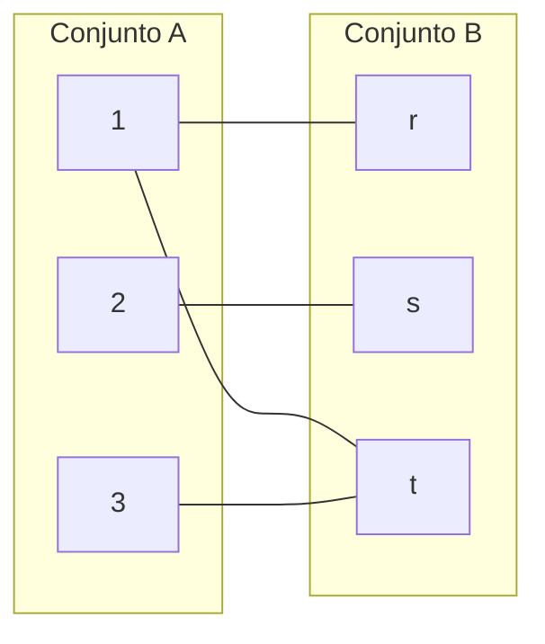
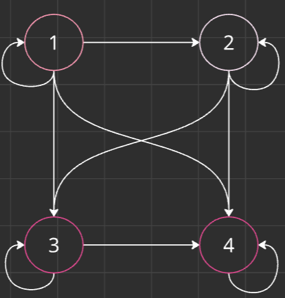

# Lógica

→ Estudio del razonamiento correcto

→ Relación de afirmaciones y no el contenido

*“Todos los matemáticos están locos”*

*“Cualquier loco es matemático”*

*→ Por lo tanto cualquier matemático es loco*

Las afirmaciones de la línea 1 y 2 proporcionan las premisas del argumento y la línea 3 proporciona una conclusión. Tan pronto como las premisas sean aceptadas, las concluyentes también deben aceptarse y el argumento es válido.

Las afirmaciones que son proposiciones pueden convertirse en sentencias matemáticas, pero se debe distinguir entre argumentos válidos y argumentos no válidos.

Los argumentos constan de ciertas proposiciones que no pueden subdividirse

→ Estas proposiciones atómicas se unen mediante conexiones lógicas

*“Si la demanda crece, entonces las compañías se expanden”*

→ Si la demanda crece: Proposición atómica.

→ “Entonces”: Conexión lógica

Proposiciones pueden ser oraciones, enunciados que sean afirmaciones y pueden tener un valor de verdadero o falso.

Ejemplo:

1. *“La tierra es plana”* → Proposición
2. “3+6=8” → Proposición
3. *“La temperatura interna del sol es de 6000° centígrados”* → Proposición
4. “x+y=2y” → Oración 
5. *“¿Desayunaron?”* → Pregunta
6. *“Tome la medicina”* → Orden
7. *“La selección Colombia ganará el partido de hoy”* → Proposición

## Clasificación de proposiciones

→ Símbolos

→ Elementos

Símbolos lógicos

→ P, Q, R

→ Usado para proposiciones atómicas o simples: Una sola oración

→ *“La tierra es plana”*

*→ “Hoy es viernes”*

*→ “El cielo es azul”*

Operadores lógicos

→ ^, v, →, ↔, **⊕, ¬**

→ Usados en proposiciones moleculares o compuestas: 2 o más proposiciones simples

→ “*Si la tierra es plana → la gravedad no existe”*

→ “*El cielo es azul v es verde”*

P: Pitágoras era griego

Q: Pitágoras era matemático

“*Pitágoras era griego y era matemático” →* “P ^ Q”

G: Colombia gana el partido

A: Brasil gana el partido

“*Colombia gana el partido y Brasil no gano” → “*G ^ ¬A”

“*Colombia no gano el partido y Brasil gano” →* “¬G ^ A”

## Operadores lógicos

### Negación y doble negación

→ Se usa para negar una proposición simple

**Tabla de verdad negación y doble negación**

| P | ¬P |
| --- | --- |
| V | F |
| F | V |

| P | ¬(¬P) |
| --- | --- |
| V | V |
| F | F |

Ejemplo

- P: El acusado dice la verdad
- ¬P: El acusado no dice la verdad
- ¬(¬P): No es cierto que el acusado no diga la verdad

### Conjunción

→ 2 afirmaciones verdaderas

→ P ^ Q son verdaderas solo si ambas son verdaderas

**Tabla de verdad conjunción**

| P | Q | P ^ Q |
| --- | --- | --- |
| V | V | V |
| V | F | F |
| F | V | F |
| F | F | F |

| P | Q | P ^ Q |
| --- | --- | --- |
| 1 | 1 | 1 |
| 1 | 0 | 1 |
| 0 | 1 | 0 |
| 0 | 0 | 0 |

Ejemplo

- *“Él gana más de 2 millones, pero menos que 4 millones”*
- “*Él gana más de 2 millones y menos que 4 millones”*

### Disyunción

→ 2 proposiciones por aparte “o”

→ Inclusiva “v”: P v Q es falsa solo si ambas son falsas

→ Exclusiva “**⊕”**: P v Q es falsa cuando ambas tienen el mismo valor

**Tabla de verdad disyunción**

| P | Q | P v Q |
| --- | --- | --- |
| V | V | V |
| V | F | V |
| F | V | V |
| F | F | F |

| P | Q | P **⊕** Q |
| --- | --- | --- |
| V | V | F |
| V | F | V |
| F | V | V |
| F | F | F |

| P | Q | P v Q |
| --- | --- | --- |
| 1 | 1 | 1 |
| 1 | 0 | 1 |
| 0 | 1 | 1 |
| 0 | 0 | 0 |

| P | Q | P **⊕** Q |
| --- | --- | --- |
| 1 | 1 | 0 |
| 1 | 0 | 1 |
| 0 | 1 | 1 |
| 0 | 0 | 0 |

Ejemplo

- “*Mañana salgo a bailar o descansare todo el día”*

### Condicional

→ Implicación

→ (P → Q) es falso si P es verdadero y Q es Falso

→ (P → Q) es desigual a (Q → P)

**Tabla de verdad condicional**

| P | Q | P →Q |
| --- | --- | --- |
| V | V | V |
| V | F | F |
| F | V | V |
| F | F | V |

| P | Q | P → Q |
| --- | --- | --- |
| 1 | 1 | 1 |
| 1 | 0 | 0 |
| 0 | 1 | 1 |
| 0 | 0 | 1 |

Ejemplo

- “*Si salgo de viaje temprano entonces llegare rápido a mi destino”*

### Bicondicional

→ P es equivalente a Q por lo que hay igualdad

**Tabla de verdad bicondicional**

| P | Q | P ↔ Q |
| --- | --- | --- |
| V | V | V |
| V | F | F |
| F | V | F |
| F | F | V |

| P | Q | P ↔ Q |
| --- | --- | --- |
| 1 | 1 | 1 |
| 1 | 0 | 0 |
| 0 | 1 | 0 |
| 0 | 0 | 1 |

Ejemplo

- “*Podré descansar temprano si solo si termino mis tareas temprano”*

### Ejercicios

1. Hacer una tabla de verdad que me muestre a partir de P y Q los operadores lógicos

| P | Q | ¬P | ¬Q | P ^ Q | P v Q | **P ⊕ Q** | P → Q | P ↔ Q | ¬(¬P) | ¬(¬Q) |
| --- | --- | --- | --- | --- | --- | --- | --- | --- | --- | --- |
| V | V | F | F | V | V | F | V | V | V | V |
| V | F | F | V | F | V | V | F | F | V | F |
| F | V | V | F | F | V | V | V | F | F | V |
| F | F | V | V | F | F | F | V | V | F | F |

| P | Q | ¬P | ¬Q | P ^ Q | P v Q | **P ⊕ Q** | P → Q | P ↔ Q | ¬(¬P) | ¬(¬Q) |
| --- | --- | --- | --- | --- | --- | --- | --- | --- | --- | --- |
| 1 | 1 | 0 | 0 | 1 | 1 | 0 | 1 | 1 | 1 | 1 |
| 1 | 0 | 0 | 1 | 0 | 1 | 1 | 0 | 0 | 1 | 0 |
| 0 | 1 | 1 | 0 | 0 | 1 | 1 | 1 | 0 | 0 | 1 |
| 0 | 0 | 1 | 1 | 0 | 0 | 0 | 1 | 1 | 0 | 0 |

1. Determine si cada oración es proposición y si lo es entonces escribir su negación
    1. 2 + 5 = 19  (P + Q = R)
        1. Proposición
        2. Negación: 2 + 5 ≠ 19  (P + Q = ¬R)
    2. Todo entero par, mayor que 4 es la suma de 2 primos (P ^ Q → R)
        1. Proposición
        2. Negación: No todos los números enteros pares mayores que 4 son la suma de 2 primos.  (¬P ^ Q → R)
2. Determine si las siguientes proposiciones moleculares son verdaderas o falsas en base a los valores iniciales 
    
    P: F     Q: V      R: F
    
    1. P ^ Q
        1. F^V = F
    2. ¬P v Q
        1. V ^ V= V
    3. ¬P v ¬(Q ^ R)
        1. V v ¬(F) 
        2. V v V 
        3.  V
    4. (P v ¬R) ^ ¬((Q v R) v (R vP))
        1. (V) ^ ¬((V) v (F)) 
        2. (V) ^ ¬(V)
        3. F
3. Tabla de verdad de cada proposición
    1. P ^ ¬Q
    
    | P | Q | ¬Q | P ^ ¬Q |
    | --- | --- | --- | --- |
    | V | V | F | F |
    | V | F | V | V |
    | F | V | F | F |
    | F | F | V | F |
    
     b. ¬(P ^ Q) v (R ^ ¬P)
    
    | P | ¬P | Q | ¬Q | R | P ^ Q | R ^ ¬P | ¬(P ^ Q) v (R ^ ¬P) |
    | --- | --- | --- | --- | --- | --- | --- | --- |
    | V | F | V | F | V | V | F | F |
    | V | F | V | F | F | V | F | F |
    | V | F | F | V | V | F | F | V |
    | V | F | F | V | F | F | F | V |
    | F | V | V | F | V | F | F | V |
    | F | V | V | F | F | F | F | V |
    | F | V | F | V | V | F | V | V |
    | F | V | F | V | F | F | F | V |
    
     c. (P v Q) ^ (¬P v Q) ^ (P v ¬Q) ^ (¬P v ¬Q)
    
    | P | Q | P v Q | ¬P v Q | P v ¬Q | ¬P v ¬Q |  (P v Q) ^ (¬P v Q) ^ (P v ¬Q) ^ (¬P v ¬Q) |
    | --- | --- | --- | --- | --- | --- | --- |
    | V | V | V | V | V | F | F |
    | V | F | V | F | V | V | F |
    | F | V | V | V | F | V | F |
    | F | F | F | V | V | V | F |
4. Construir la tabla de verdad
    - “Mi tío no vino a dormir y no fue a trabajar”
        - Identificar símbolos lógicos en la proposición
        
        → P: Mi tío no vino a dormir
        
        → Q: No fue a trabajar
        
        - Traducción lógica (negativos)
        
        → ¬P y ¬Q
        
        - Definir cuantas posibles variables
        
        → P, Q: $2^2$
        
        → P, Q, R: $2^3$
        
        - Definir la tabla de verdad para las proposiciones y para la combinación
        
        | P | Q | ¬P | ¬Q | ¬P ^ ¬Q |
        | --- | --- | --- | --- | --- |
        | V | V | F | F | F |
        | V | F | F | V | F |
        | F | V | V | F | F |
        | F | F | V | V | V |
        
    
    ## Premisas y conclusiones
    
    Lógica → Estudiar la validez de los argumentos
    
    → Argumento → Número de proposiciones o premisas → 1 premisa = Conclusión
    

                           ↓

        → Validez

Proposición 1, Proposición 2 **∴** Conclusión  → Premisas

 

Ejemplo

“Si Alfredo es elegido presidente de la junta de acción comunal entonces Carmelo es elegido vicepresidente y Martin es elegido tesorero, Carmelo no es elegido vicepresidente por lo tanto Alfredo no es elegido presidente de la junta de acción comunal”

1. Premisas:
    1. Premisa 1: “Si Alfredo es elegido presidente de la junta de acción comunal entonces Carmelo es elegido vicepresidente y Martin es elegido tesorero”
    2. Premisa 2: “Carmelo no es elegido vicepresidente”
    3. Conclusión: “Por lo tanto Alfredo no es elegido presidente de la junta de acción comunal”
2. Proposiciones
    1. A = Alfredo es elegido presidente de la junta de acción comunal
    2. B = Carmelo es elegido vicepresidente
    3. C = Martin es elegido tesorero
3. Traducción lógica
    1. (A → B) ^ C        - Proposición 1
    2. ¬B                        - Proposición 2
    3. ∴  ¬A                   - Conclusión

## Reglas de inferencia y clasificación de argumento

Reglas → Tautología

Inferencia → Contradicción

Clasificación → Contingencia

### Tautología

→ Una proposición es verdadera para todas las proposiciones que sean verdaderas

| P | P ↔ P |
| --- | --- |
| V | V |
| F | V |

### Contradicción

→ Si la proposición ofrece un resultado de valor de verdad entonces será falso

| P | ¬P | P ^ ¬P |
| --- | --- | --- |
| V | F | F |
| F | V | F |

### Contingencia

→ Puede ser verdadero y falso dependiendo del valor de verdad de los componentes simples

| P | Q | ¬P | ¬P v Q |
| --- | --- | --- | --- |
| V | V | F | V |
| V | F | F | F |
| F | V | V | V |
| F | F | V | V |

Ejemplo

1. Verificación de validez

{[(A → B) ^ C] ^ ¬B} ∴  A

| A | B | C | ¬A | ¬B | (A→B) | (A→B)^C | [(A→B)^C]^¬B | {[(A → B) ^ C] ^ ¬B} ∴  A |
| --- | --- | --- | --- | --- | --- | --- | --- | --- |
| V | V | V | F | F | V | V | F | V |
| V | V | F | F | F | V | F | F | V |
| V | F | V | F | V | F | F | F | V |
| V | F | F | F | V | F | F | F | V |
| F | V | V | V | F | V | V | F | V |
| F | V | F | V | F | V | F | F | V |
| F | F | V | V | V | V | V | V | F |
| F | F | F | V | V | V | F | F | V |
1. “Si Jorge estudia entonces aprobará ciencias computacionales básicas y pensamiento algorítmico, Jorge no aprobó ciencias computacionales básicas, en consecuencia, Jorge no estudio ni aprobó pensamiento algorítmico”
    1. Premisa 1: Si Jorge estudia entonces aprobará ciencias computacionales básicas y pensamiento algorítmico
    2. Premisa 2: Jorge no aprobó ciencias computacionales básicas
    3. Conclusión: En consecuencia, Jorge no estudio ni aprobó pensamiento algorítmico
        1. P - Proposición 1: Jorge estudia
        2. Q - Proposición 2: Jorge aprueba ciencias computacionales básicas
        3. R - Proposición 3: Jorge aprueba pensamiento algorítmico
    
    - (P → Q) ^ R
    - ¬Q
    - ∴  ¬P ^¬R
        
        {[(P → Q) ^ R] ^ ¬Q} ∴  (¬P ^ ¬R)
        
        | P | Q | R | ¬P | ¬Q | ¬R | (Q^R) | [P→(Q^R) | {[(P → Q) ^ R] ^ ¬Q}  | (¬P^¬R) | {[(P → Q) ^ R] ^ ¬Q} ∴  (¬P ^ ¬R) |
        | --- | --- | --- | --- | --- | --- | --- | --- | --- | --- | --- |
        | V | V | V | F | F | F | V | V | F | F | V |
        | V | V | F | F | F | V | F | F | F | F | V |
        | V | F | V | F | V | F | F | F | F | F | V |
        | V | F | F | F | V | V | F | F | F | F | V |
        | F | V | V | V | F | F | V | V | F | F | V |
        | F | V | F | V | F | V | F | V | F | V | V |
        | F | F | V | V | V | F | F | V | V | F | F |
        | F | F | F | V | V | V | F | V | V | V | V |
    
    ## Reglas de inferencia
    
    → Permiten definir la validez o la no validez de las premisas de los argumentos con simplificaciones cuando se tienen 3 o mas premisas
    
    ### Modus Ponen (MP)
    
    → Eliminar el antecedente siempre que la segunda premisa haga parte de la primera
    
    1. P → Q
    2. P
    3. ∴ Q
    
    ### Modus Tollens (MT)
    
    → Eliminar el consecuente siempre que se encuentre negado
    
    1. P → Q
    2. ¬Q
    3. ∴ ¬P
    
    ### Silogismo Disyuntivo (SD)
    
    → Eliminar una de las disyunciones siempre que en la segunda premisa este negado
    
    1. P v Q
    2. ¬P
    3. ∴ Q
    
    ### Silogismo Hipotético (SH)
    
    → Eliminar de la primera premisa el consecuente siempre que sean iguales
    
    1. P → Q
    2. Q → R
    3. ∴  P → R
    
    ### Adición
    
    → Sumar variables proposicionales a las premisas
    
    1. P
    2. ∴  P v Q
    
    ### Simplificación
    
    → Eliminar proposiciones en las premisas que no se necesitan
    
    1. P ^Q
    2. ∴ P
    
    ### Conjunción
    
    → Unión de 2 premisas
    
    1. P
    2. Q
    3. ∴ P ^ Q
    
    ### Dilema Constructivo
    
    → Eliminar antecedentes, da como resultado una disyunción
    
    1. (P→ Q) ^ (R → S)
    2. P v R
    3. ∴ Q v S
    
    ### Dilema Destructivo
    
    → Eliminar antecedentes siempre y cuando estén vinculados a través de una relación y negación de los consecuentes
    
    1. (P → Q) ^ (R → S)
    2. ¬Q → ¬ S
    3. ∴ ¬P → ¬R
    
    ## Reglas de reemplazo/equivalencias
    
    → Sustituir una parte del argumento para confirmar validez o no
    
    ### Leyes de Morgan
    
    → De disyunción a conjunción
    
    1. ¬(P v Q) ≡ ¬P ^ ¬Q
    2. ¬(P ^ Q) ≡ ¬P v ¬Q
    
    ### Conmutación
    
    → Establecer y cambiar el orden lógico de la proposición
    
    1. (P v Q) ≡ (Q v P)
    2. (P ^ Q) ≡ (Q ^ P)
    3. (P ↔ Q) ≡ (Q ↔ P)
    
    ### Doble negación
    
    → Si tenemos una negación que se vuelve a negar es afirmación
    
    1. ¬(¬P) ≡ P
    
    ### Distribución
    
    → Se opera dentro de paréntesis y se distribuye fuera de los mismos
    
    1. P ^ (Q v R) ≡ (P ^ Q) v (P ^ R)
    2. P v (Q ^ R) ≡ (P v Q) ^ (P v R) 
    
    ### Tautología
    
    → Unir 2 proposiciones en una sola
    
    1. (P ^ Q) ≡ P
    2. (P v P) ≡ P
    
    ### Asociación
    
    → Aplica si tenemos el mismo operador lógico
    
    1. P ^ (Q ^ R) ≡ (P ^ Q) ^ R
    2. P v (Q v R) ≡ (P v Q) v R
    
    ### Implicación Material
    
    → Implica a disyunción o conclusión
    
    1. P → Q ≡ ¬P v Q
    
    ### Transposición
    
    → Tener una negación del consecuente implica que se niega el antecedente también
    
    1. P → Q ≡ ¬Q → ¬P
    
    ### Exportación
    
    → Cambiar conjunción a una implicación
    
    1. [(P ^ Q) → R] ≡ [P → (Q → R)]
    
    ### Equivalencia material
    
    → Si tenemos una relación con doble implicación es igual a la conjunción/disyunción de sus implicaciones
    
    1. (P ↔ Q) ≡ (P → Q) ^ (Q → P)
    2. (P ↔ Q) ≡ (P ^ Q) v (¬P → ¬Q)
    
    ## Prueba Formal de Validez
    
    1. Asignar a las proposiciones un símbolo lógico (P, Q, R, A, entre otros)
    2. Traducir las proposiciones a premisas lógicas
    3. Organizar el argumento de forma vertical separando una de la otra
    4. Usar reglas de inferencia/remplazo que puedan conducir a nuevas premisas para simplificar
    5. Obtener el resultado o conclusión
    
    Ejemplo
    
    “Si la ley no fue aprobada entonces la constitución del país queda sin modificaciones, si la constitución del país quedan sin modificaciones no se pueden elegir nuevos diputados o se eligen nuevos diputados o el informe del presidente del país se retrasará, el informe no se atrasó un mes por lo que la ley fue aprobada”
    
    1. Asignar símbolos lógicos a las proposiciones
        1. L: “La ley fue aprobada”
        2. C: “La constitución quedó sin modificaciones”
        3. D: “Se elijen nuevos diputados”
        4. I: El informe del presidente se atrasó un mes
    2. Traducir a proposiciones lógicas en formato vertical
        1. (¬L → C)
        2. (C → ¬D)
        3. (D v I)
        4. ¬ I
        5. ∴  L
    3. Usar reglas de inferencia/remplazo para crear nuevas premisas
        1. SD en a y b = D
        2. MT en b y  a2 = ¬C
        3. MT en a1 y b2 = L
    4. Obtuvimos el resultado o conclusión “L” por lo que confirmamos que es un argumento válido.
    
    Ejemplo
    
    “Si el tiempo es agradable entonces el cielo esta despejado si el cielo esta despejado entonces iré de día de campo, si el tiempo es agradable entonces iré de día de campo implica que si el cielo esta despejado entonces nadaré en el rio, si el tiempo es agradable entonces nadare en el rio implica que me broncearé por lo tanto me broncearé todo el cuerpo”
    
    1. -
        1. T: “El tiempo es agradable”
        2. D: “El cielo esta despejado”
        3. C: “Iré de día de campo”
        4. N: “Nadaré en el rio”
        5. B: “Me broncearé todo el cuerpo”
    2. -
        1. T → D
        2. D → C
        3. (T → C) → (D → N)
        4. (T → N) → B
        5. ∴ B
    3. -
        1. SH en a y b = T → C
        2. MP en a2 y c = D → N
        3. SH en a1 y b2 = T → N
        4. SH en c2 y d= B
    
     
    
    Ejemplo
    
    1. (¬H v I) → (J → K)
    2. (¬L ^ M) → (K → N)
    3. (H → L) ^ (L → H)
    4. (¬L ^ ¬M) ^ ¬I
    
    ∴  J → N
    
    1. ¬L ^ ¬M - *Simplificación 4*
    2. ¬L - *Simplificación 5*
    3. H → L - *Simplificación 3*
    4. K → N - *MP 2 y 5*
    5. ¬H -*MT 7 y 6*
    6. ¬H v I - *Adición* 
    7. J → K - *MP 1 y 10*
    8. J → N - *SH 11 y 8*
    
    ## Prueba de invalidez
    
    1. Asignar a las proposiciones un símbolo lógico (P, Q, R, A, entre otros)
    2. Traducir las proposiciones a premisas lógicas
    3. Organizar el argumento de forma horizontal
    4. Aplicar valores de verdad a la conclusión para que el resultado sea falso siempre
    5. Como la conclusión es falsa las premisas deben de tener un valor de verdadero resolviendo operaciones lógicas
    
    Ejemplo
    
    “Si llueve entonces me mojo si sale el sol entonces me pongo ropa ligera me mojo o sale el sol por lo tanto llueve o me pongo ropa ligera”
    
    1. Asignar símbolos lógicos
        1. L: “Llueve”
        2. M: “Me mojo”
        3. S: “Sale el sol”
        4. R: “Me pongo ropa ligera”
    2. Traducir a premisas lógicas organizadas de forma horizontal
        1. {[(L → M) ^ (S → R)] ^ (M v S)} ∴ (L v R)
        
        ```mermaid
        graph TD
            %% Nodos principales para las operaciones
            A["L → M (F,V)"] --> E["V"]
            B["S → R (F,F)"] --> F["V"]
            C["M v S (V,F)"] --> G["V"]
            D["L v R (F,F)"] --> H["F"]
        
            %% Uniones de resultados
            E --> I["V"]
            F --> I
            I --> J["V"]
            G --> J
            J --> K["F"]
            H --> K
        
            %% Estilo y colores
            style A fill:##f2d5f2,stroke:#333
            style B fill:##f2d5f2,stroke:#333
            style C fill:##f2d5f2,stroke:#333
            style D fill:##f2d5f2,stroke:#333
            style K fill:##f2d5f2,stroke:#333
        ```
        
    
    Ejemplo
    
    1. A → (B → C)
    2. B → (¬C → D)
    3. (C v D) → E
    4. ∴  A → E
    
    {[(A → (B → C)) ^ (B → (¬C → D)) ^ ((C v D) → E)]} ∴ (A → E)
    
    ```mermaid
    graph TD
        %% Nodos principales para las operaciones
        A["A → (B → C) (V,F,F)"] --> E["V"]
        B["B → (¬C → D) (F,V,F)"] --> F["V"]
        C["(C v D) → E (F,F,F)"] --> G["V"]
        D["A → E (F,F)"] --> H["F"]
    
        %% Uniones de resultados
        E --> I["V"]
        F --> I
        I --> J["V"]
        G --> J
        J --> K["F"]
        H --> K
    
        %% Estilo y colores
        style A fill:##f2d5f2,stroke:#333
        style B fill:##f2d5f2,stroke:#333
        style C fill:##f2d5f2,stroke:#333
        style D fill:##f2d5f2,stroke:#333
        style K fill:##f2d5f2,stroke:#333
    ```
    
    Ejercicios
    
    Realice la prueba de invalidez en los siguientes argumentos
    
    1. 
        1. A ↔ B
        2. C → D
        3. B ↔ C
        4. ∴ A ^ D
        
        {[(A ↔ B) ^ (C → D)] ^ (B ↔ C)} ∴ A ^ D
        
        ```mermaid
        graph TD
            %% Nodos principales para las operaciones lógicas
            A["A ↔ B (F,F)"] --> E["V"]
            B["C → D (F,V)"] --> F["V"]
            C["B ↔ C (F,F)"] --> G["V"]
            D["A ^ D (F,V)"] --> H["F"]
        
            %% Uniones de resultados
            E --> I["V"]
            F --> I
            I --> J["V"]
            G --> J
            J --> K["F"]
            H --> K
        
            %% Estilo y colores
            style A fill:##f2d5f2,stroke:#333
            style B fill:##f2d5f2,stroke:#333
            style C fill:##f2d5f2,stroke:#333
            style D fill:##f2d5f2,stroke:#333
            style K fill:##f2d5f2,stroke:#333
        ```
        
    2. 
        1. H → (I v J)
        2. J → (S ^ X)
        3. ¬S
        4. ∴ H → X
    
    {[(H → (I v J)) ^ (J → (S ^ X))] ^ ¬S} ∴ H → X
    
    ```mermaid
    graph TD
        %% Nodos principales para las operaciones lógicas
        A["H → (I v J) (V,V,F)"] --> E["V"]
        B["J → (S ^ X) (F,F,F)"] --> F["V"]
        C["¬S (V)"] --> G["V"]
        D["H → X (F,V)"] --> H["F"]
    
        %% Uniones de resultados
        E --> I["V"]
        F --> I
        I --> J["V"]
        G --> J
        J --> K["F"]
        H --> K
    
        %% Estilo y colores
        style A fill:##f2d5f2,stroke:#333
        style B fill:##f2d5f2,stroke:#333
        style C fill:##f2d5f2,stroke:#333
        style D fill:##f2d5f2,stroke:#333
        style K fill:##f2d5f2,stroke:#333
    ```
    
    ## Prueba Condicional
    
    → Para revisar la validez del argumento y de la conclusión
    
    1. Asignar a las proposiciones un símbolo lógico (P, Q, R, A, entre otros)
    2. Traducir las proposiciones a premisas lógicas
    3. Organizar el argumento de forma vertical
    4. Cuando el antecedente de la conclusión es una implicación se toma como una premisa mas
    5. Consecuente de la conclusión como la conclusión final
    6. Usar prueba de validez hasta llegar a el resultado/conclusión
    
     
    
    Ejemplo
    
    Demostrar la validez por medio de prueba condicional
    
    “Si salgo temprano de trabajar entonces iré a la fiesta si voy a la fiesta entonces vere a la chica que me gusta si veo a la chica que me gusta entonces bailare toda la noche por lo que si salgo temprano de trabajar bailare toda la noche”
    
    1. 
        1. T: “Salgo temprano”
        2. F: “Iré a la fiesta”
        3. C: “Veré a la chica que me gusta”
        4. B: “Bailaré toda la noche”
    2. 
        1. T → F
        2. F → C
        3. C → B
        4. ∴ T → B
    3.         ↓
        1. T → F
        2. F → C
        3. C → B
        4. T
        5. ∴ B
    4. 
        1. F - *MP a y d*
        2. C - *MP b y a2*
        3. B - *MP a y b2*
    5. Como llegamos a la conclusión podemos confirmar la validez del argumento
    
    Ejercicio
    
    “Si estudio implica que si apruebo ciencias básicas entonces pasare el semestre, por lo tanto, si estudio entonces aprobare ciencias básicas implica que si estudio pasare el semestre”
    
    1. 
        1. E: “Estudio”
        2. S: “Pasaré el semestre”
        3. C: “Apruebo ciencias básicas”
    2. 
        1. E → (C → S)
        2. ∴ (E → C) → (E → S)
    3.         ↓
        1. E → (C → S)
        2. (E → C)
        3. ∴ (E → S)
    4.        ↓
        1. E → (C → S)
        2. (E → C)
        3. E
        4. ∴ S
    5. 
        1. C - *MP b y c*
        2. C → S - *MP a y c*
        3. S - *MP a2 y b2*
    
    Ejercicio
    
    1. Si P y Q son falsas y R y S son verdaderas cual es el valor de verdad de las siguientes premisas:
        1. ¬(P ^ R)
            1. Verdadero
        2. ¬(P v ¬R)
            1. Verdadero
        3. ¬(¬P v ¬Q) → S
            1. Verdadero
        4. ¬(¬(¬P) ^ ¬(¬Q))
            1. Verdadero
    2. Teniendo en cuenta las siguientes proposiciones, traduzca a lenguaje natural
        1. F: “Como frutas y verduras”
        2. S: “Estoy Sano”
            1. F ^ S: “Como frutas y estoy sano”
            2. ¬F: “No como fruta”
            3. ¬(¬F): “No es verdad que no como frutas”
            4. ¬(F → S): “No es cierto que si como frutas estaré sano”
            5. (F → ¬S): “Como frutas entonces no estoy sano”
            6. ¬(F ↔ S): “No es cierto que si solo si como frutas estaré sano”
    
    ## Primer Principio de inducción matemática
    
    → En las proposiciones tecnico-matematico que tienen la siguiente construcción:
    
    → Base propositiva Pn → V
    
    → Base inductiva P(n+1) → V
    
    Si Pn (base propositiva) es verdadera P(n+1) (base inductiva) es verdadera siempre que Pn sea verdadera
    
    Pn → Pn+1 → Para todo n que pertenezca a los números positivos 
    
    ∑ → suma referenciada dentro de una cota
    
    $n∑(k=1) K² = (1)²+(2)²+(3)³+(n)²$
    
    Ejemplo 
    
    Demostrar la sumatoria $3∑(k=1) (3k-2) = 1/2(3n²-n) |∀ n ∈+$
    
    Pn extender a $n=k | k ∈+$
    
    $Pn= 1/2 (3 (1)² - 1) = 1 →(3 (1) - 2) = 1$
    
    → Comprobar que $K→ 3∑(k=1)(3k-2)$ es igual a $n→1/2(3 (1)² - 1)$ si da el mismo número es valido
    
    $Pm [m∑(k=1) (3k-2)=1/2 (3 m² - m)]$ → Hipótesis
    
     
    
    Se quiere comprobar que P(m+1) sea verdadera
    
    $m+1∑(k=1)(3k-2) = 1/2(3(m+1)^2 -(m+1))$
    
    → Desarrollamos el lado izquierdo
    
     $m∑(k=1)(3k-2) = m∑(k=1)(3k-2)+(3(m+1)-2)$
    
    → Usamos la hipotesis
    
    $= 1/2(3m^2 - m) + (3m + 3 - 2) = = 1/2 (3m^2 - m) + (3m+1)$
    
    → $(3m^2 + 5m +2)/(2)$
    
    → Desarrollamos el lado derecho
    
    = $1/2 (3(m+1)^2 - (m + 1))$ 
    
    = $1/2(3(m^2 + 2m +1) - m - 1)$
    
    = $1/2(3m^2 +5m +2)$
    
    → Comparamos el resultado de ambos lados
    
    $(3m^2 + 5m +2)/(2) = (3m^2 + 5m +2)/(2)$
    
    → Como ambos lados son iguales podemos concluir que la fórmula es válida para $n=m+1$
    
    Ejercicio
    
    1. Caso base n=1, evaluar para ambos lados los valores
        1. $P(n) = 1+2+3+…+n = (n(n+1)/(2)$
            
            → Reemplazamos las incógnitas con el número de caso base
            
        2. $1 = 1(1+1)/2 → 1 = 1$
            
            → Se cumple el caso base
            
    2. Plantear la hipótesis de inducción: Suponer verdadero que n=k
        1. $P(k) = 1+2+3+…+k = k(k+1)/(2)$
            
            → Suponemos valida
            
    3. Inductivo la formula sea válida para n=k+1
        1. $P(k+1) = 1+2+3+…+k+(k+1) = k+1(k+2)/2$
            
            → Usamos hipótesis de inducción
            
        2. $P(k+1) = P(k) + k+1$
        3. $P(k+1) = k(k+1)/(2) + (k+1)$
            
            → $k(k+1)+(2k+2)/(2)$
            
            →$k^2 + k+2k+2/2$
            
            →$k^2 +3k+2/2$
            
            →$(k+1)(k+2)/2$
            
    4. Comparamos
        1. $k+1(k+2)/(2) = (k+1)(k+2)/(2)$
    
    # Teoría de conjuntos
    
    ## Relaciones de conjuntos
    
    → Se opera los elementos de 1 o más conjuntos
    
    ### Producto cartesiano
    
    → Dos conjuntos A y B no vacíos se denotan AxB, pares ordenados (ai, bi) donde ai ∈ A y bi ∈ B.
    
    AxB    (ai, bi)      AxB= {(a, b) | a∈A ^ b∈B}
    
    A≠0                      AxB ≠ BxA
    
    B≠0
    
    Ejemplo
    
    A= {1, 2, 3} → Dominio
    
    B= {r, s} → Rango
    
        ↓
    
    AxB= {(1, r), (1, s), (2, r), (2, s), (3, r), (3, s)}
    
    BxA= {(r, 1), (r, 2), (r, 3), (s, 1), (s, 2), (s, 3)}
    
    ### Relación binaria
    
    → R ⊆ (AxB) si A ≠ B → aRb
    
    → Si A=B entonces R ⊆ (AxA)
    
    → R ⊆ (BxA) si B≠A → bRa
    
    → Si B=A entonces R ⊆ (BxB)
    
    Ejemplo
    
    A es conjunto de N, sobre A elegir el primer número ≤ al segundo elemento
    
    - R= {(a, b) | a ≤ b ^ a, b ∈ A} → Relación entre el conjunto, par ordenado y la representación
    
           ↓
    
    - ∀ (a, b) ∈ R si a ≤ b, a, b ∈ A → Otra forma de escribir la representación
    
           ↓
    
    - aRb si a ≤ b, a, b ∈ A → Otra forma de escribir la representación
    
    Ejercicio
    
    Si se tienen 2 conjuntos A y B y se quiere construir una R de pares ordenado donde el primero es distinto del segundo, escriba la representación
    
    → R ⊆ (AxB)= {(a, b) | a ≠ b, a ∈ A ^ b ∈ B}
    
    → ∀ (a, b) ∈ R si a ≠ b, a ∈ A, b ∈ B
    
    → aRb si a ≠ b, a ∈ A, b ∈ B
    
    Ejercicio
    
    Sea A= {1, 2, 3, 4} si R= {a, b | a/b sea entero}
    
    → R= {(2, 1), (2, 2), (3, 1), (4, 1), (4, 2), (1, 1), (4, 4), (3, 3)}
    
    R= {(1, r), (2, s), (3, t)}
    
    Dom(R)= {1, 2, 3}   Ran(R)= {r, s, t}
    
    ### Graficas
    
    R= {(1, r), (2, s), (3, t), (1, t)
    
    Tabla
    
    | R | r | s | t |
    | --- | --- | --- | --- |
    | 1 | • |  | • |
    | 2 |  | • |  |
    | 3 |  |  | • |
    
    | A | B |
    | --- | --- |
    | 1 | r |
    | 1 | t |
    | 2 | s |
    | 3 | t |

Diagrama



Matriz

| 1 | 0 | 1 |
| --- | --- | --- |
| 0 | 1 | 0 |
| 0 | 0 | 1 |

Ejercicio

R= {(a, b) | a^b ∈ A}   A= {1, 2, 3, 4}

→R= {(1, 1), (1, 2), (1, 3), (1, 4), (2, 2), (2, 3), (2, 4), (3, 3), (3, 4), (4, 4)}

Diagrama



## Relaciones

→ Relaciones de “Relaciones”

→ RS → Pares ordenados

### Unión


→ R∪S

→ aR∪Sb = aRb v aSb

### Intersección


→ R∩S

→aR∩Sb = aRb ^ aSb

### Diferencia


→ R - S

→ a(R - S)b = aRb ^ a /S b

### Diferencia Simétrica


→ R⊕S = (RUS)-(R∩S)

→ (aRb)⊕(aSb) = (aRb v aSb) - (aRb ^ aSb)

Ejemplo

B= {1, 2, 3}                                         R= {(a, 1), (a, 2), (b, 3)}

A= {a, b, c}                                        S= {(a, 2), (b, 3)}

Determina las siguientes operaciones:

R∪S= {(a, 1), (a, 2), (b, 3)}

R∩S= {(a, 2), (b, 3)}

R-S= {(a, 1)}

R⊕S= {(a, 1)}

### Relación Complemento


→ aR’b = a/Rb → Sin R

Ejemplo

A= {a, b, c}                                               R= {(a, x), (b, z), (a, y)}

B= {x, y, z}                                                S= {(a, y), (b, z)}

1. Establecer producto cartesiano
    
    → (a, x), (a, y), (a, z), (b, x), (b, y), (b, z), (c, x), (c, y), (c, z)
    
2. Identificar pares ordenados faltantes en la relación
    
    → R1 = R2= {(a, z), (b, x), (b, y), (c, x), (c, y), (c, z)}
    
    → S1 = S2= {(a, x), (a, z), (b, x), (b, y), (c, x), (c, y), (c, z)}
    

Ejemplo

A= {b, l, m, n}                         R= {(a, b) | a ∈ A, b+1 ∈ B}

B= {1, 2, 3, 4)                          R= {(b, 2), (b, 3), (b, 4), (l, 2), (l, 3), (l, 4), (m, 2), (m, 3), (m, 4), (n, 2), (n, 3), (n, 4)}

AxB= {(b, 1), (b, 2), (b, 3), (b, 4), (l, 1), (l, 2), (l, 3), (l, 4), (m, 1), (m, 2), (m, 3), (m, 4), (n, 1), (n, 2), (n, 3), (n, 4)}

→ R1= Rc= {(b, 1), (l, 1), (m, 1), (n, 1)}

### Relación inversa

→ R-1= {(b, a) | (a, b) ∈ R}

Ejemplo

A= {2, 3, 4}                        R= {(a, b) | b=Ka, a ∈ A, b ∈ B}

B= {3, 4, 5, 6, 7}

→ R= {(2, 4), (2, 6), (3, 3), (3, 6), (4, 4)}

→ R-1= {(4, 2), (6, 2), (3, 3), (6, 3), (4, 4)}

### Cardinales de una relación

→ aRb |R| = Numero de pares

→ Si R tiene 5 pares ordenados entonces |R|= 5

### Conjunto potencia

→ aRb P(R) → subconjuntos de R

→ P(R)= {S | S ⊆ R}

→ |R|= n →  |PR|= $2^n$

Ejemplo

A= {1, 2, 3}                        R= {(1, 1), (1, 2), (1, 3)}

1. |R|= 3
2. |PR|= $2^3$ = 8 → Subconjuntos
3. P(R)= {0}, {(1, 1)}, {(1, 2)}, {(1, 3)}, {(1, 1), (1, 2)}, {(1, 1), (1, 3)}, {(1, 2), (1, 3)}, {(1, 1), (1, 2), (1, 3)} → Todas las combinaciones posibles de los pares ordenados del conjunto (relación) y empieza siempre en 0

## Composición de Relaciones

→ Operación entre 2 relaciones R y S

→ 3 o más conjuntos

→ aRb y bSc

RoS= {(a, c) | aRb  ^ bSc , a ∈ A, b ∈ B, c ∈ C} = RoS= {(a, c) | aRb (a, b) ∈ R ^ bSc (b, c) ∈ S, a ∈ A, b ∈ B, c ∈ C}

Ejemplo

A= {1, 2, 3}            B= {1, 2, 3, 4}              C= {0, 1, 2}

R= {(1, 1), (1, 4), (2, 3), (2, 3), (3, 1), (3, 4)}

S= {(1, 0), (2, 0), (3, 1), (3, 2), (4, 1)}

SoR= {(1, 0), (1, 1), (2, 1), (2, 2), (3, 1)}


Ejemplo

A= {1, 2, 3}       B= {f, g, h, k}           C= {♥, ☼, ♣}

R ⊆ AxB= {(1, f), (1, g), (1, h), (1, k), (2, f), (2, g), (2, h), (2, k), (3, f), (3, g), (3, h), (3, k)}

L ⊆ BxC= {(f, ♥), (f, ☼), (f, ♣), (g, ♥), (g, ☼), (g, ♣), (h, ♥), (h, ☼), (h, ♣), (k, ♥), (k, ☼), (k, ♣)}

→ LoR= {(♥, 1), (☼, 1), (♣, 1), (♥, 2), (☼, 2), (♣, 2), (♥, 3), (☼, 3), (♣, 3)}

→ RoL= {(1, ♥), (1, ☼), (1, ♣), (2, ♥), (2 ☼), (2, ♣), (3, ♥), (3, ☼), (3, ♣)}

Ejemplo

X= {1, 2}                                     R1= {(1, 1), (1, 2)}

     ↓                                            R2= {(1, 2), (2, 1)}

Si solo tenemos un conjunto, lo escribimos varias veces hasta llegar a 3

→ R1oR2= {(2, 1), (1, 1)}

→ R2oR1= {(1, 2), (1, 1)} 


Ejemplo

A= {a, b, c, d}                            B= {s, t, u, v}                            C= {1, 2, 3, 4, 5}

L= {(a, s), (a, t), (c, v), (d, u)}                      K= {(s, 2), (t, 1), (t, 4), (u, 3)}

KoL= {(a, 2), (a, 1), (a, 4), (d, 3)}

R, S, T → Relaciones

aRb ^ bSc ^ cTd → (a, d)

To(SoR) = (ToS)oR

Ejemplo

A= {a, b, c, d}          B= {s, t u, v}          C= {1, 2, 3, 4, 5}          D= {♥, ♣, ○)

aRb= R= {(a, s), (a, t), (c, v), (d, u)}

bSc= S= {(s, 1), (s, 4), (t, 3), (u, 3)}

cTd= T= {(2, ♥), (1, ♣), (4, ○), (5, ♣)}

SoR= {(a, 1), (a, 4), (a, 5), (d, 3)}

To(SoR)= {(a, ♣), (a, ○)}

ToS= {(s, ♣), (s, ○)

(ToS)oR= {(a, ♣), (a, ○)}

## Potencias de relaciones

→ Base que multiplica múltiples veces

Conjunto A   → $R = R^1$  

→ Composición:

→ $RoR = R^2$

→ $RoRoR = Ro(RoR) = RoR^2 = R^3$

Ejemplo

A= {a, b, c, d}                                       R= {(a, a), (b, a), (c, b), (d, c)}

$R^m = (m=4) → R^4$

1. Empezamos con $RoR = R^2$
    1. {(a, a), (b, a), (c, a), (d, b)}
2. $RoR^2$
    1. {(a, a), (b, a), (c, a), (d, a)}
3. $RoR^3$
    1. {(a, a), (b, a), (c, a), (d, a)}

## Propiedades de las relaciones

A= {1, 2, 3, 4}

R= {(1, 1), (1, 2)), (2, 1), (2, 2), (3, 4), (4, 1), (4, 4)}

S= {(1, 1), (1, 2), (2, 1)}

T= {(1, 1), (1, 2), (1, 4), (2, 1), (2, 2), (3, 3), (4, 1), (4, 4)}

U= {(2, 1), (3, 1), (3, 2), (4, 1), (4, 2), (4, 3)}

V= {(1, 1), (1, 2), (1, 3), (1, 4), (2, 2), (2, 3), (2, 4), (3, 3), (3, 4), (4, 4)}

W= {(3, 4)}

### Reflexiva

→ Pares ordenados tales que ambos sean (a, a) e incluya todos los elementos de a en ambos lados del par

→ aRa ­­≡ ∀a | aRa

→ T y V tienen los pares: (1, 1), (2, 2), (3, 3), (4, 4), por lo que son reflexivos.

### Irreflexiva

→ Para todos los elementos de a no debe de tener ninguno de los elementos del conjunto original, las relaciones no incluyen pares ordenados (a, a)

→ ∀a (aRa)

→ U y W no incluyen los pares (1, 1), (2, 2), (3, 3), (4, 4), por lo que son irreflexivos.

Tablas

| R | 1 | 2 | 3 | 4 |
| --- | --- | --- | --- | --- |
| 1 | • | • |  |  |
| 2 | • | • |  |  |
| 3 |  |  |  | • |
| 4 | • |  |  | • |

| T | 1 | 2 | 3 | 4 |
| --- | --- | --- | --- | --- |
| 1 | • | • |  | • |
| 2 | • | • |  |  |
| 3 |  |  | • |  |
| 4 | • |  |  | • |

| S | 1 | 2 | 3 | 4 |
| --- | --- | --- | --- | --- |
| 1 | • | • |  |  |
| 2 | • |  |  |  |
| 3 |  |  |  |  |
| 4 |  |  |  |  |

| U | 1 | 2 | 3 | 4 |
| --- | --- | --- | --- | --- |
| 1 |  |  |  |  |
| 2 | • |  |  |  |
| 3 | • | • |  |  |
| 4 | • | • | • |  |

| V | 1 | 2 | 3 | 4 |
| --- | --- | --- | --- | --- |
| 1 | • | • | • | • |
| 2 |  | • | • | • |
| 3 |  |  | • | • |
| 4 |  |  |  | • |

### Simétrica

→ (a, b) = (b, a) dentro de los pares ordenados, cada par ordenado tiene su inverso

→ ∀a ∀b | aRb → bRa

→ S y T incluyen los pares (1, 2), (2, 1) y (1, 4), (4, 1) respectivamente, por lo que son simétricos 

### Antisimétrica

→ No pertenecen a la relacion si no encontramos (a, b) no hay (b, a), ningun par ordenado de la relacion tiene su inverso

→ ∀a ∀b | aRb ^ bRa → a=b → a/Rb v a/Rb (a≠b)

→ U, V, W no contienen pares ordenados con su inverso, por lo que son antisimétricos

## Relaciones Transitivas

→ aRb → bRc, establecer una relacion entre a y c aRc

→ ∀a, b, c (aRb)^(bRc) → aRc

→ (3, 2) ∈ U → (2, 1) ∈ U → (3, 1)

| U | 1 | 2 | 3 | 4 |
| --- | --- | --- | --- | --- |
| 1 |  |  |  |  |
| 2 | • |  |  |  |
| 3 | • | • |  |  |
| 4 | • | • | • |  |

| V | 1 | 2 | 3 | 4 |
| --- | --- | --- | --- | --- |
| 1 | • | • | • | • |
| 2 |  | • | • | • |
| 3 |  |  | • | • |
| 4 |  |  |  | • |


U

→ Podemos visualizar en una tabla que se encuentra una forma triangular, esto indica posible transisividad

→ Si en el digrafo se forma un cuadrado, esto nos indica que una relación es transitiva

### Transtiva extensiva

→ R sobre A, R1 sobre A

→R ⊆ R1, ∀ a,b ∈  aRb → (a, c) ∈ R1

Ejemplo

A= {a, b, c, d}                                   R= {(a, b), (b, c), (c, d), (c, b)}

1. Buscar subconjunto R1 basado en R
    1. R1= {(a, b), (a, c), (b, b), (b, c), (b, d), (c, c), (c, b), (c, d)}
    
    → Incluye los pares de R y los pares producto de la transitividad
    

### Cerradura transitiva

→ R ⊆  R1 ⊆ R2 ⊆ Ri+1

→ R1, R2, Ri+1 → Extensiones transitivas

→ {R∪R2∪R3} = R☼

Ejemplo

A= {a, b, c, d}                                                        R= {(a, b), (b, c), (c, b), (c, d)}

- Buscar la cerradura transitiva de R
    1. Buscamos R1
    
    → R1= {(a, b), (b, c), (c, b), (c, d), (a, c), (b, b), (b, d), (c, c)}
    
    1. Buscamos R2
    
    → R2= {(a, b), (b, c), (c, b), (c, d), (a, c), b, b), (b, d), (c, c), (a, d)
    
    1. Revisamos el digrafo, si la relacion es transivita entonces es igual al R☼
        
        → Como R2 es transitiva, R2=R☼
        
    
    
    

## Relacion de equivalencia

→ De relacion a conjunto

### Particiones de A

→ Subconjuntos disjuntos que no sean vacios y que la particion genere A al unir los subconjuntos

→ S particion de A

→ Ai ≠ 0, Ai∩Aj= 0 | i≠j

→ S= {A1, A2, A3, A4}

→ A1∪A2∪A3∪A4 = A

Ejemplo

Sea A= {x | x es una letra del alfabeto}

A1= {a, e, i, o, u}                            S= {(a, e, i, o, u), (w, c), (b, f, g, h, j, k, l), (m, n, ñ, p, q), (r, s, t, u), (x, y), (d, z)

A2= {w, c}                                      S= {A1, A2, A3, A4, A5, A6, A7}

A3= {b, f, g, h, j, k, l}                     A= A1, A2, A3, A4, A5, A6, A7

A4= {m, n, ñ, p, q}

A5= {r, s, t, u}

A6= {x, y}

A7= {d, z}

A= {a, b, c, d, f, g, h}                   S= {(a, b), (c, d, e), (f), (g, h)}

B= {2, 4, 6, 8, 10, 12}                    S= {(2, 4), (6, 8, 10), (12)}

Ejemplo

S es una particion de A aRb si para algun Ai en S a ∈  Ai ^ b ∈   Ai

→ R es transitiva, simétrica y reflexiva

A= {a, b, c, d, e, f}                S= {(a, c, e), (b, f), (d)}

R= {(a, a), (b, b), (c, c), (d, d), (e, e), (f, f), (a, c), (c, a), (a, e), (e, a), (c, e), (e, c), (b, f), (f, b)}

## Relaciones de equivalencias

→ Reflexiva

→ Simétrica 

→ Transitiva

→ Sobre A o sobre un subconjunto 

Ejemplo

A= {1, 2, 3, 4}                            R= {(1, 1), (1, 2), (1, 3), (1, 4), (2, 2), (2, 3), (2, 4), (3, 3), (3, 4), (4, 4)}

Como determinar si R es equivalente sobre A.

1. ¿R es reflexiva? → Si (1, 1), (2, 2), (3, 3), (4, 4)
2. ¿R es simétrica? → Es antisimetrica (2, 1), (3, 1), (4, 1), (3, 2), (4, 2), (4, 3) ∉ R
3. ¿R es transitiva? → Si, (a, b), (b, c) ∈ R → (a, c) ∈ R
    
    → R no es una relacion equivalente porque no es simetrica, para ser equivalente debe de complir las 3 condiciones.
    

### Clases de equivalencia

→ Tenemos una relacion que es equivalente sobre A

→ x ∈ A        a= {x ∈ A| xRa}     S= {[a] | a ∈ A} (particion)

Ejemplo

A= {a, b, c, d, e, f}      R= {(a, a), (a, c), (a, e), (c, a), (c, c), (c, e), (e, a), (e, e), (b, b), (b, f), (f, b), (f, f), (d, d)}

Cuales son las clases de equivalencia

- [a]= (a, c, e)
- [b]= (b, f)
- [c}= (a, c, e)
- [d]= (d)
- [e]= (a, c, e)
- [f]= (b, f)

- [a] = [c] = [e] = (a, c, e)
- [b] = [f] = (b, f)
- [d] = (d)

→ S= {(a, c, e), (b, f), (d)} → A1∪A2∪A2= A

### Relaciones

→ Equivalencias: Forma matematica de organizar o clasificar cosas

→Orden: Ordenamiento de objetos “padre-hijos”, secuencias, ordenación de objetos

→ Relacion: Objecto matematico para relacionar conceptos de uno o más conjuntos.

→ Pares ordenados vinculados (a, b)

Dominio de R basado en un conjunto A es un subconjunto de A que tiene una conecion con otro elemento → D(R)

D(R)= {x ∈ A| ∃ y, xRy}             

Codominio de R basado en un conjunto A es un subconjunto de A en el que alguno esta acompañado

D’(R)= {x ∈ A| ∃ y, yRx}

Ejemplo

A= {1, 2, 3}                              R1= {(1, 2), (1, 3), (2, 3)}      R2= {(1, 1), (1, 3), (2, 2), (3, 1), (3, 3)}

R1 → Orden habitual a<b

R2 → Relación de paridad


R2

D(R2)= {1, 2, 3}

R-1= {(a, b) ∈ A AxA| bRa}

Ejemplo 

A= {1, 2, 3, 4}                       R= {(1, 1), (1, 2), (2, 1), (2, 2), (3, 3), (3, 4), (4, 3), (4, 4)}

Obtener las clases de equivalencia de A


→ No es transitiva

1. 
    
    [1]= (1, 2)
    
    [2]= (1, 2)
    
    [3]= (3, 4)
    
    [4]= (3, 4)
    
    [1] = [2] = (1, 2)
    
    [3] = [4] = (3, 4)
    
    S= {(1, 2), (3, 4)} → Partición de A
    

## Conjuntos parcialmente ordenados

→ POSET (A, R) Relacion R basado en A (A, ≤) que tiene elementos (a, b) donde a ∈ A, b ∈ B

Si a ∈ A, b ∈ A, a/≤b ^ b/≤a → son comparables

Si a ∈ A, b ∈ A, a/≤b ^ a≤b → son incomparables

Ejemplo

A conjunto Z+ (a, b) ∈ R | a/b

Determinar (A, R) es POSET

1. R es reflexiva a/a
2. a/b → b/a: (a=b) antisimetrica
3. a/b ^b/c → a/c es transitiva

                ↓

Como solo se cumplen 2 de 3 condiciones entonces se clasifica como POSET (A, ≤)

Si R esta en A son de m orden si todo a ∈ A estan en el dominio o en contradomnio son transitivas y asimetricas

→ (a, b) ∈ R ^(a<b)

Relacion ORDEN → ORDEN/Inverso

### Maximal

→ Un elemento de A se define como Maximal si no precede a ningun otro elemento

→ a maximal ↔ ∀x, a/<x

### Minimal

→ Un selemento de A se define como minimal si no sucede a otro elemento

→ a minimal ↔ ∀x, a/>x

Ejemplo

Hacer un conjunto (a, b) |a= letra, b= número

A= {(m, 6), (f, 8), (t, 4), (p, 2)}

(p, 2) < (t, 4) < (m, 6) < (f, 8)

→ (p, 2) = Minimal

→ (f, 8) = Maximal

Ejemplo

A= {1, 2, 3, 4, 5}        R= {(1, 1), (1, 2), (1, 3), (1, 4), (1, 5), (2, 2), (2, 3), (2, 5), (3, 3), (4, 4), (4, 5), (5, 5)}

- Determinar cuáles son comparables e incomparables

Caso 1: 1/≤1, 1/≤2, 1/≤3, 1/≤4, 1/≤5

→ 1 es comparable con 1, 2, 3, 4, 5

Caso 2:  2/≤2, 2/≤3, 2/≤5

→ 2 es comparable con 2, 3, 5

Caso 3:  3/≤3, 3/≤5

→ 3 es comparable com 3, 5

Caso 4:  4/≤4, 4/≤5

→ 4 es comparable con 4, 5

Caso 5: 5/≤5

→ 5 es comparable con 5

Caso 6:  2/≤4, 4/≤2 → No hacen parte de la relación

→ 2 y 4 son incomparables

Caso 7:  4/≤3, 3/≤4, → No hacen parte de la relación

→ 3 y 4 son incomparables

## Conjunto totalmente ordenado

→ R en A si cualquier par de elementos de A son comparables

→ R es totalmente ordenado cuando (A, /≤)

→ a/≤b v b/≤a es verdadero

Ejemplo

A subconjunto de los numeros naturales

R= {(a, b) ∈ R | a≥ b} 

Si (A, ≤) es totalmente ordenado

R es POSET:

→ Como cualquier entero natiral a≥a es reflexiva, b≤a es antisimetrica, a≥b → a≥c es transitiva.

Si se toman 2 elementos de los numeros naturales:

>Construir un conjunto A donde a ∈ N y a<10

>Definir R de pares ordenados (a, b)| 5(a-b), a≠b

A= {a| a ∈ N ^ a<10}     R= {(a, b) | 5(a-b), (a≠b)}

R= {(2, 1), (3, 2), (4, 3), (5, 4), (6, 5), (7, 6), (8, 7), (9, 8)}

W= {(a, b) | a+b ≤1} →   W= {(1, 1), (2, 1), (1, 2)}

V= {(a, b) | a+3b=13} →  V= {(1, 4), (4, 3), (10, 1), (7, 2)}


→ Transitiva, reflexiva y antisimetrica

B= {1, 2, 3, 4, 5}               R={(1, 1), (1, 3), (2, 2), (3, 1), (3, 3), (4, 4), (5, 5)}

→ No es equivalente

# Sucesiones y Secuencias

→ Secuencias → Lista de números ordenados segun un criterio

→ Función de tipo A N→ R

→ a(n)=an -Enesimo termino

→ Notacion {an}n-1= a1, a2, a3, …

Ejemplo

1, 3, 5, 7 (impares)              an=2n-1 → Regla

                                                        ↓

a=1, a2= 3, a3= 5                  a1= 2(1)-1    a2=2(2)-1

→ Sucesiones → Secuencias en lista “ordenada”

## Tipos de secuencias

### Aritmetica

→ Cada tercer resultado sucede de la constante d (diferencia común)

→ Sucesion infinita, se suma el número al anterior

Ejemplo

2, 5, 8, 11, …                                    d= 5-2=3 → Puede ser suma o resta

→ 2 (+3), 5 (+3), 8 (+3), 11 (+3), … 

### Progresiones caso especial sucesiones

→ Sucesion respecto a un término y el siguiente

### Geometricas

→ Cada termino se multiplica por una constante r

Ejemplo

4, 8, 16, 32, …                                           r= 8/4=2

4 (x2), 8 (x2), 16 (x2), 32 (x2), …

→ Recurrente: an es dependiente de los anteriores

Ejemplo

Fibbonacci   1, 1, 2, 3, 5, 8, …                 an= an-1+an-2

→ Formulaciones explicitas 

$an= n^2 (1, 4, 9, 16)$

Ejemplo

→ Determinar termino 100

{an}= {10, 14, 18, 22, …} 

{bn}= {3, 3.5, 4, 4.5}

{cn}= {9, 6, 3, 0}

→ Formulas explicitas

${an}= 10 +(n-1)(4)= 10+4n-4= 6-4n$

$bn= 3+(n-1)(0.5) = 2.5 + 0.5n$

$cn= 9+(n-1)(-3)= 12-3n$

→ Encontramos el termino requerido (100) usando la formula explicita

$a100= 6+4(100)= 406$

$b100= 2.5 + 0.5(100)= 52.5$

$c100= 12-3(100)= -288$

Ejemplo

a1 >A     a9=12       d=2

→ Usamos los datos conocidos para encontrar el termino inicial

$a1= an-(n-1)d$

→ $a1= 12 -(9-1)(2)$

→$a1= 12-(8)(12)$

→$a1= -4$

{an} ={-4, -2, 0, 2, 4, 6, 8, 10, 12}

Ejemplo

Determinar el valor de la diferencia común en una progresion aritmetica

a1= -2             a7= 16

$d= (an-a1)/(n-1)$

→ $d= (16- (-2))/(7-1)$

→ $d= 3$

{an}= {-2, 1, 4, 7, 10, 13, 16}

Ejemplo

Determinar la cantidad de terminos de una progresion aritmetica

a1= 4          an=34        d=5

$n= (an-a1)/(d)+1$

→ $n= (34-4)/(5)+1$

→ $n= (30)/(5)+1$

→  $n= 7$

{an}= {4, 9, 14, 19, 24, 29, 34}

Ejemplo

Determinar a9

a3= 1          d= 2

$an= ak+(n-k)d$

→ $an=1+(9-3)(2)$

→ $an= 1+12$

→ $an= 13$

{an}= {-3, -1, 1, 3, 5, 7, 9, 11, 13}

## Progresion Aritmetica

→Sucesion infinita, se suma el número al anterior, cada tercer resultado sucede de la constante d (diferencia común)

a1, a2, a3, …, an

→ Hacer 2 veces la suma - se invierte el orden 1+2+3 ↔ 3+2+1

{an}= {a1+a2+a3+…+an-1+an}

{an}= {an+an-1+…+a3+a2+a1}

2an=(a1+an)(a2+an-1)+…+(an-1+a2)(an+a1)

(a2+an-1)= a1+d+an-1

an= (n(a1+an)/(2) → para n sumas

Ejemplo

Determinar lla suma de una progresion aritmetica

1+2+3+4+…+100

n= 100         a1= 1           an= 100

1. Utilizamos la expresion y reemplazamos terminos

$an=(n(a1+an)/(2)$

→ $a100= (100(1+100)/(2)$

→ $a100= 5050$

Ejemplo

A350= 1+3+5+7+…+2n-1

n=350              a1= 1             an=2n-1

$a350= (350(1+(2(350)-1))/(2)$

$a350= (350(700))/(2)$

$a350= (245000)/(2)$

$a350= 122500$

## Progresiones Geometricas

→ Secuencia de números vinculados a un factor (multiplicación) en donde estarian multiplicados por una constante r

→ Formulas:

r^n-1= (a2)/(a1)

an= r^n-1(a1)

a1= (an)/(r^n-1)

r= n-1√(an)/(a1)

n= (log(an)/(a1))/(logr)+1

Ejemplo

an= an-1(r)


                                           ↓

a1= 18

a2= (5/4)*18

a3= (5/4)^2*18

a4= (5/4)^3*18

an= r^(n-1)*a1

Determinar altura del escalon 800

→ a800= (5/4)^799*18

→ a800= 4,85x10^78

an= {3 (+3), 6 (+3), 9 (+3), 12 (+3), …} → Progresion aritmetica

an= {3 (x2), 6 (x2), 12 (x2), 24 (x2), …} → Progresion geometrica

bn= {12 (x1/3), 4 (x1/3), 4/3 (x1/3), …} → Progresion geometrica

cn= {0.6 (x10), 6 (x10), 60 (x10), 600 (x10), …} → Progresion geometrica

r= >1 → Crece

r= 2= {2, 4, 8, 16, …} → Crece

r= 1 → Constante

r= 1= {2, 2, 2, 2, …} → Constante

r= <1 → Decrece

r= 0.8= {2, 1.6, 1.28, …} → Decrece

r= negativo → Oscila

r= -1= {1, -1, 1, -1, …} → Oscila

Ejemplo

Determinar termino 20

an= {3, 6, 12, 24, …}

bn= {12, 4, 4/3, 4/9, …}

cn= {0.6, 6, 60, 600, …)

→ a20= 2^19(3) = 1’572,864

→b20= 1/3^19(12) = 1,03x10^-8

→cn20= 10^19(0.6) =6x10^18

Ejemplo

De estos datos de una progresion geometrica, obtenga la progresion resultante

a3= 4              r=√2

a1=(an)/(r^n-1)

a1=(4)/(√2^3-1)

a1= 2

an= {2, 2√2, 4, 4√2, 8, 8√2, …}

Ejemplo

Encontrar la razon comun

a1= 2               a6= 64

r= n-1√(an)/(a1)

r= 5√(64)/(2)

r=2

an= {2, 4, 8, 16, 32, 64, …}

Ejemplo

Obtenga una progresion aritmetica cuyos valores a4=18 y a10= 48, encuentre la diferencia común

an= a1 + (n-1)d

→ 48= 18 +(7-1)d

→48-18= 6d

→30/6 =d

→5 =d

an= {3, 8, 13, 18, 23, 28, 33, 38, 43, 48, …}

Ejemplo

a1, a2, a3, a4, a5, a6, 11/√2, a8, a9, a10, a11, a12, a13, a14, a15, 14

a7= 11/√2

a16= 14

an= a1 +(n-1)d

14= 11/√2 (10-1)d

14-11/√2= 9d

6.22/9 = d

0.69= d

an= {3.63, 4.32, 5.01, 5.70, 6.39, 7.08, 11/√2, …}

# Introduccion teoria de números

NxN: (a, b)….

Ejemplo

Relacion de parejas ordenadas

 a, b       c, d               A partir de esta relacion Z= {(a, b) |(a, b) ∈  NxN}

(3, 2) y (2, 1)

(a. b) ≡ (c, d)

a+b ≡ b+c

Operaciones enteras

→ Addición: [(a, b)] + [(c, d)]= (a+c, b+d)

→ Multiplicación: [(a,b) x [(c, d)]= (ac+bd, bc+ad)

→ Inversa additiva: -[(a, b)] = [(b, a)]

→ Neutra additiva: Oz = (a, a) | a ∈  N

→ Neutra multiplicativa: 1z = (a, 1a)

## Principios multiplicativos y aditivos

→ Combinatorio: Conjuntos donde se conocen sus elementos

Conteo de un conjunto → cardinal

→ Se divide en subconjuntos cuyos pares sean faciles de calcular

### Principio Aditivo

→ Definir el cardinal de los subconjuntos siempre y cuando sean disjuntos de 2 en 2 (no comparten elementos)

A1, A2, A3, … → Finitos y disjuntos de 2 en 2

Cardinal (A1 ∪ A2 ∪ A3 ∪ … An}

       ↓

Cardinal {A1} + cardinal {A2} + cardinal {A3} + …

Ejemplo

Lanzamos 4 monedas cuantas formas hay de conseguir 2 caras

A= Conjunto de todos los lanzamientos donde se obtengan 2 caras

A2= Conjunto de lanzamientos donde hay 2 caras

A2= {(c, c, s, s), (c, s, c, s), (s, c, s, c), (s, s, c, c), (c, s, s, c), (s, c, c, s)}

A3= Conjunto de lanzamientos donde se obtienen 3 caras

A3= {(c, c, c, s), (c, c, s, c), (c, s, c, c), (s, c, c, c)}

A4= Conjunto de lanzamientos donde se obtienen 4 caras

A4= {(c, c, c, c)}

Cardinal A= Card A2 + Card A3 + Card A4

Cardinal A= 6+4+1

Cardinal A= 11

Ejemplo

2 dado → ∑ del resulktado de multiplos de 4 y 6

A1= ∑ pares multiplos de 4      A2= ∑ pares multiplos 6

A1= {(1, 3), (3, 1), (2, 2), (2, 6), (6, 2), (4, 4), (6, 6), (5, 3), (3, 5)}

A2= {(3, 3), (6, 6), (4, 2), (2, 4), (5, 1), (1, 5)}

→ Como hay elementos que se encuentran en ambos conjuntos entonces no son disjuntos

→ A Cardinal= Card A1 + Card A2 - Card A1∩CardA2

→ A Cardinal= 9+5-1= 13

### Principio multiplicativo

→ Listas de longitud r donde r= al número de elementos y el orden de los mismos si importa

1 Lista tiene n1 elementos

2 Lista tiene n2 elementos

Ejemplo

Tenemos {1, 2, 3, 4, 5 ,6 7} formar elementos de 4 cifras sin repetir el numero (a, b, c, d)

a= 7 Opciones distintas

b= 6 Opciones distintas

c= 5 Opciones distintas

d= 4 Opciones distintas

→ Cuando el número no se repite: 7x6x5x4= 840 alternativas posibles

→ Cuando el número se repite: 7x7x7x7= 2401 alternativas posibles

Son pares d= 2, 4, 6

a= 7     b= 7     c= 7     d= 3

7x7x7x3= 1029 alternativas posibles

Ejemplo

Palabra clave 4 caracteres entre 26 posibles letras mayusculas y un numero del 0 al 9

2AAA - ¿Cuantas opciones se pueden formar?

AAAA- No valido

Clave en secuencia {c1, c2, c3, c4} 3 digitos

c1= número o letra= 26+10= 36

c2= número o letra= 26+10= 36

c3= número o letra= 26+10= 36

c4= número o letra= 26+10= 36

C-Co= c1 ∪ c2 ∪  c3 ∪  c4

36^4-26^4= 1’222,640 posibles formas de contraseña

## Combinación y permutación

→ “Orden” Lista de elementos que podrian o no repetirse

→ Variaciones y permutaciones → Variaciones con repetición

### Combinaciones con/sin repeticion

→ El orden no importa

→ Variaciones de K elementos A= {a1, a2, a3, …, an}

→ Numero de posibles variaciones

→ v(n,k)= n(n-1)(n-2)…(n-k+1)= (n!)/(n-k)!

Ejemplo

A= {a, b, c, d}       palabras 2 letras

Formar cuplas (a, b), (a, c), (a, d), (a, a), (b, b), (c, c), (d, d)

(b, a), (b, c), (b, d)

(c, a), (c, b), (c, d)

(d, a), (d, b), (d, c)

v(4, 2)= 12 → Sin repeticiones

v(4, 2)= 16 → Con repeticiones

### Listas y Permutación

→ Secuencias → Combinaciones

→ El orden SI importa en un conjunto especifico, quien empieza, quien termina.

Ejemplo 

x= {a, b, c}

Permutaciones: (a, b, c), (b, a, c), (c, b, a), (c, a, b), (b, c, a), (a, c, b)

Permuntación 1 solo elemento: a, b, c

Permutacion 2 elementos: (a, b), (a, c), (c, b), (b, a), (c, a), (b, c)

Permutacion 3 elementos: (a, b, c), (b, a, c), (c, b, a), (c, a, b), (b, c, a), (a, c, b)

Combinación: (a, b, c) = (b, a, c) = (c, b, a) = (c, a, b) = (b, c, a) = (a, c, b)

Combinatoria implica una variación

nk → (v(nk))/(k!) → (n!)/((n-k)!k!)

Ejercicio

Se quiere crear un comite con un presidente, secretario y un vocal.

15 personas.

Presidente: 15 opciones

Secretario: 14 opciones

Vocal: 13 opciones

15x14x13= 2730 posibles formas de elección

x= {a, b, c, d}

Permutacion 2= {ab, ba, ac, ca, ad, da, bc, cb, cd, dc, bd, db}

           ↓

Cardinalidad= 12

Generalizar 

→ p (n, n)= n (n-1) (n-2) (n-3) … (3) (2) (1) → n!

→ (n-k)! = (n-k) … (3) (2) (1)

→ p(n-k) (n-k)! = n!

→ p(n, k)= (n (n-1) (n-2) (n-3) … (n-k+1) (n-k) … (3) (2) (1))/ (n-k) (n-k-1) … (1)

                 ↓

→ p(n, k)= (n!)/(n-k)!

Ejemplo

10 personas quieren elegir un comite de presidente, secretario y tesorero

n= 10 personas

k= 3 personas (comite)

p(10, 3) = (10!)/(10-3)!

p(10, 3)= 720 opciones de elección

Ejemplo

Fila 7 mexicanos, 5 estadunidenses que se forman de manera intercalada

_ M1 _ M2 _ M3 _ M4 _ M5 _ M6 _ M7 _ → 8 espacios donde pueden formarse los estadunidenses

M! = 7! = 5040

orden: p(8, 5)= (8!)/(8-5)! = 6720

→ Orden total= 5040x6720= 33’868,800 formas en que se puede formar la fila.

Ejercicio

1. 3 examenes en 5 dias, no puede haber 2 examenes en el mismo dia 
    1. p(5, 3)= (5!)/(5-3)! = 60 posibles combinaciones
2. 3 pelotas de diferente color en 10 cajas, cada caja puede contener n cantidad de pelotas, de cuantas maneras distintas se pueden acomodar las pelotas
    
    → Caja 1: 3 opciones
    
    → Caja 2: 3 opciones
    
    → Caja 3: 3 opciones
    
    → 3x3x3= 27 maneras distintas para acomodar las pelotas
    

### Combinaciones

→ Lista de n elementos, se parte de la permutacion

→ Formula

nk= P(n,k) x 1/k!

Ejemplo

Programar spagetti 3 veces por semana, de cuantas maneras distintas se puede programar

7/3= 7!/4! x 1/3! = 35 formas de programarlo

Ejemplo

10 personas quieren elegir un comite de 4 personas, combinacion

10/4= 10!/(10-4)!(4!) = 210 combinaciones de elección

Ejemplo

La loteria baloto combina 6n^5 de 49 posibles 

n= 49              k=6

49/6= 49!/(49-7)!(6!) = 13’983,816

Ejemplo

Supoonemos 2 factores multiplicacion de 2, 3, 5, cuantos sin repetir y cuantos con repetición

→ Sin repetir (2x3, 2x5, 3x5)

n= 3    k=2

3/2= 3!/(3-2)!(2!) = 3

→ Repitiendo (2x2, 3x3, 5x5, 2x3, 2x5, 3x5)

n= 4    k=2

4/2= 4!/(4-2)!(2!) = 6

Ejercicio

3 platos de entrada, 2 platos fuertes, 4 postres

3x2x4= 24 opciones de almuerzo

Ejercicio

Una persona tiene 9 obras de arte y los quiere heredar a sus 3 hijos, ¿De cuantas formas diferentes puede entregar a sus hijos esas obras?, cada hijo debe tener la misma cantidad de obras.

n= 9  → n=6 → n=3

k= 3

9/3= 9!/(9-3)!(3!) = 84

6/3= 6!/(6-3)!(3!) = 20

3/3= 3!/(3-3)!(3!) = 1

84x20x1= 1680

## Concepto de divisibilidad

a y b ∈ Z a≠0 a/b → a “divide” b = c ∈ Z → resultado de la division

→ b= ac

a es el factor de b si a|b

Propiedades

1. a|b si solo si |a| |b| donde
    
    x= {x si x ≥ 0, -x si x≤0}
    
2. a/0     1/a
3. a/a
4. a/b   b/a → a= +- b
5. Transitivo a/b   b/c → a/c
6. Si a/b → a≤b

### Algoritmo de division

a, b ∈ Z  b≠0

$a= qb+r$ donde q es el cociente y r el residuo

Ejemplo

Cuadrado de un numero $a→ 3k; 3k+1$

$a^2 entre 3$ → Resultado posible 0, 1, 2

1. 
    
    $a= 3q$
    
    $a^2= 9q^2$
    
    $a^2= 3(3q^2) → K$
    
    $a^2= 3K$
    
2. 
    
    $(a)^2= (3q+1)^2$
    
    $a^2= (9q^2+6q+1)$ 
    
    $a^2= 3(3q^2+2q)+1 → K$
    
    $a^2= 3K+1$
    
3. -
    
    $(a)^2= (3q+2)^2$
    
    $a^2= 9q^2+12q+3+1$
    
    $a^2= 3(3q^2+4q+1)+1$
    
    $a^2= 3K+1$
    

## Sistemas numericos

### Enumeración base decimal

→ 0, 1, 2, 3, 4, 5, 6, 7, 8, 9

10^2+10^1+10^6

108

→ en base 10:

$1x10^2+0x10^1+8x10^0$

→ en base 2:

$1x2^6+1x2^5+0x2^4+1x2^3+1x2^2+0x2^1+0x2^0$

→ 1101100

General b≥2

n= amb^m + am+… a2b^2+a1b^1+a0b^0

n= (am am-1… a2 a1 a0)b

Pasar b=10 a base b

1025 a base 7→ Dividimos sucesivamente entre 7

Algoritmo de division= $a= qb+r$

$1025= (146)7+(3)$

$1025= ((20)7+(6))7+3$

$1025= (((2)7+(6))7+6)7+3)$

$1025= 2x7^3+6x7^2+6x7^1+3x7^0$

$1025= (2663)7$

Base 10 a base 16 → decimal a hexadecimal

(0, 1, 2, 3, 4, 5, 6, 7, 8, 9) → 0 1 2 3 4 5 6 7 8 9 A B C D E F

$3027= (189)16+3$

$3027= ((11)16+13)16+3)$

→ $Bx16^2+Dx16^1+3x16$

→ $(BD3)16$

$4033= (252)16 +1$

$4033= ((15)16*2)16+1$

→ $Fx16^2+Cx16^1+1x16^0$

→ $(FC1)16$

### MCD

→ Para 2 numeros → Aplicar algoritmo de division para encontrar el maximo comun divisor

→ Calculo efectivo

→ Combinacion lineal enteros

Sea a y b | a≠0 o b≠0

MCD (a, b) al entero

1. d/a y d/b → Siendo d un divisor comun tanto para a como b
2. c/a y c/b → c≤d

MCD (-12,18) = 6

| Divisores de -12 | Divisores de 18 |
| --- | --- |
| -12 | -18 |
| -6 | -9 |
| -4 | -6 |
| -3 | -3 |
| -2 | -2 |
| -1 | -1 |
| 1 | 1 |
| 2 | 2 |
| 3 | 3 |
| 4 | 6 |
| 6 | 9 |
| 12 | 18 |

→ $MCD(6,9)= 3= 6(-1)+9(1)$

T= a(divisor)+b(divisor)

→ T= $ax+by$   x,y ∈ Z

multiplo d= MCD (a,b)

Sí a,b enteros no nulos a≠0 y b≠0

MCD(a,b) = 1 primos

$1=a0X+b0y$   x,y ∈ Z

Ejemplo

n ∈ Z         $5n+2 y 7n+3$= son coprimos

$(5n+2)x0+(7n+3)y0= 1$

$5nx0+2x0+7ny0+3y0= 1$

$n(5x0+7x0) +(2x0+3y0)= 1$

$n(5x0+7y0)=0$

$2x0+3y0= 1$

→ $x0= -7$

→ $y0= 5$

$(5n+2)-7+(7n+3)5=1$
