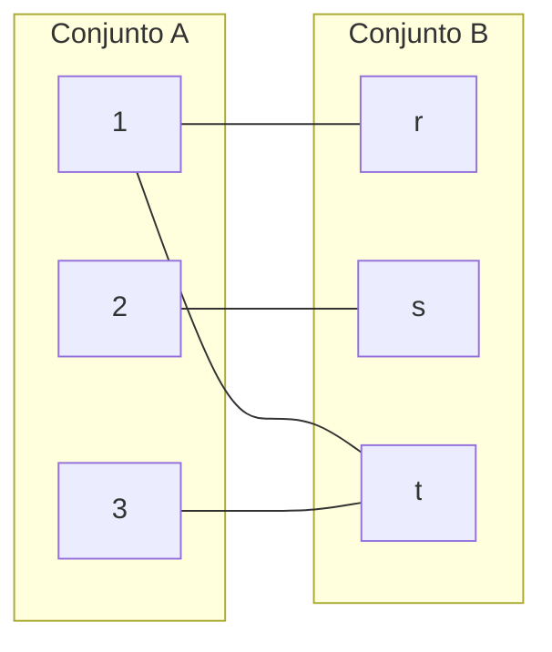

# Teoría de conjuntos
    
    ## Relaciones de conjuntos
    
    → Se opera los elementos de 1 o más conjuntos
    
    ### Producto cartesiano
    
    → Dos conjuntos A y B no vacíos se denotan AxB, pares ordenados (ai, bi) donde ai ∈ A y bi ∈ B.
    
    AxB    (ai, bi)      AxB= {(a, b) | a∈A ^ b∈B}
    
    A≠0                      AxB ≠ BxA
    
    B≠0
    
    Ejemplo
    
    A= {1, 2, 3} → Dominio
    
    B= {r, s} → Rango
    
        ↓
    
    AxB= {(1, r), (1, s), (2, r), (2, s), (3, r), (3, s)}
    
    BxA= {(r, 1), (r, 2), (r, 3), (s, 1), (s, 2), (s, 3)}
    
    ### Relación binaria
    
    → R ⊆ (AxB) si A ≠ B → aRb
    
    → Si A=B entonces R ⊆ (AxA)
    
    → R ⊆ (BxA) si B≠A → bRa
    
    → Si B=A entonces R ⊆ (BxB)
    
    Ejemplo
    
    A es conjunto de N, sobre A elegir el primer número ≤ al segundo elemento
    
    - R= {(a, b) | a ≤ b ^ a, b ∈ A} → Relación entre el conjunto, par ordenado y la representación
    
           ↓
    
    - ∀ (a, b) ∈ R si a ≤ b, a, b ∈ A → Otra forma de escribir la representación
    
           ↓
    
    - aRb si a ≤ b, a, b ∈ A → Otra forma de escribir la representación
    
    Ejercicio
    
    Si se tienen 2 conjuntos A y B y se quiere construir una R de pares ordenado donde el primero es distinto del segundo, escriba la representación
    
    → R ⊆ (AxB)= {(a, b) | a ≠ b, a ∈ A ^ b ∈ B}
    
    → ∀ (a, b) ∈ R si a ≠ b, a ∈ A, b ∈ B
    
    → aRb si a ≠ b, a ∈ A, b ∈ B
    
    Ejercicio
    
    Sea A= {1, 2, 3, 4} si R= {a, b | a/b sea entero}
    
    → R= {(2, 1), (2, 2), (3, 1), (4, 1), (4, 2), (1, 1), (4, 4), (3, 3)}
    
    R= {(1, r), (2, s), (3, t)}
    
    Dom(R)= {1, 2, 3}   Ran(R)= {r, s, t}
    
    ### Graficas
    
    R= {(1, r), (2, s), (3, t), (1, t)
    
    Tabla
    
    | R | r | s | t |
    | --- | --- | --- | --- |
    | 1 | • |  | • |
    | 2 |  | • |  |
    | 3 |  |  | • |
    
    | A | B |
    | --- | --- |
    | 1 | r |
    | 1 | t |
    | 2 | s |
    | 3 | t |

Diagrama

Matriz

| 1 | 0 | 1 |
| --- | --- | --- |
| 0 | 1 | 0 |
| 0 | 0 | 1 |

Ejercicio

R= {(a, b) | a^b ∈ A}   A= {1, 2, 3, 4}

→R= {(1, 1), (1, 2), (1, 3), (1, 4), (2, 2), (2, 3), (2, 4), (3, 3), (3, 4), (4, 4)}

Diagrama

## Relaciones

→ Relaciones de “Relaciones”

→ RS → Pares ordenados

### Unión

→ R∪S

→ aR∪Sb = aRb v aSb

### Intersección

→ R∩S

→aR∩Sb = aRb ^ aSb

### Diferencia

→ R - S

→ a(R - S)b = aRb ^ a /S b

### Diferencia Simétrica

→ R⊕S = (RUS)-(R∩S)

→ (aRb)⊕(aSb) = (aRb v aSb) - (aRb ^ aSb)

Ejemplo

B= {1, 2, 3}                                         R= {(a, 1), (a, 2), (b, 3)}

A= {a, b, c}                                        S= {(a, 2), (b, 3)}

Determina las siguientes operaciones:

R∪S= {(a, 1), (a, 2), (b, 3)}

R∩S= {(a, 2), (b, 3)}

R-S= {(a, 1)}

R⊕S= {(a, 1)}

### Relación Complemento

→ aR’b = a/Rb → Sin R

Ejemplo

A= {a, b, c}                                               R= {(a, x), (b, z), (a, y)}

B= {x, y, z}                                                S= {(a, y), (b, z)}

1. Establecer producto cartesiano
    
    → (a, x), (a, y), (a, z), (b, x), (b, y), (b, z), (c, x), (c, y), (c, z)
    
2. Identificar pares ordenados faltantes en la relación
    
    → R1 = R2= {(a, z), (b, x), (b, y), (c, x), (c, y), (c, z)}
    
    → S1 = S2= {(a, x), (a, z), (b, x), (b, y), (c, x), (c, y), (c, z)}
    

Ejemplo

A= {b, l, m, n}                         R= {(a, b) | a ∈ A, b+1 ∈ B}

B= {1, 2, 3, 4)                          R= {(b, 2), (b, 3), (b, 4), (l, 2), (l, 3), (l, 4), (m, 2), (m, 3), (m, 4), (n, 2), (n, 3), (n, 4)}

AxB= {(b, 1), (b, 2), (b, 3), (b, 4), (l, 1), (l, 2), (l, 3), (l, 4), (m, 1), (m, 2), (m, 3), (m, 4), (n, 1), (n, 2), (n, 3), (n, 4)}

→ R1= Rc= {(b, 1), (l, 1), (m, 1), (n, 1)}

### Relación inversa

→ R-1= {(b, a) | (a, b) ∈ R}

Ejemplo

A= {2, 3, 4}                        R= {(a, b) | b=Ka, a ∈ A, b ∈ B}

B= {3, 4, 5, 6, 7}

→ R= {(2, 4), (2, 6), (3, 3), (3, 6), (4, 4)}

→ R-1= {(4, 2), (6, 2), (3, 3), (6, 3), (4, 4)}

### Cardinales de una relación

→ aRb |R| = Numero de pares

→ Si R tiene 5 pares ordenados entonces |R|= 5

### Conjunto potencia

→ aRb P(R) → subconjuntos de R

→ P(R)= {S | S ⊆ R}

→ |R|= n →  |PR|= $2^n$

Ejemplo

A= {1, 2, 3}                        R= {(1, 1), (1, 2), (1, 3)}

1. |R|= 3
2. |PR|= $2^3$ = 8 → Subconjuntos
3. P(R)= {0}, {(1, 1)}, {(1, 2)}, {(1, 3)}, {(1, 1), (1, 2)}, {(1, 1), (1, 3)}, {(1, 2), (1, 3)}, {(1, 1), (1, 2), (1, 3)} → Todas las combinaciones posibles de los pares ordenados del conjunto (relación) y empieza siempre en 0

## Composición de Relaciones

→ Operación entre 2 relaciones R y S

→ 3 o más conjuntos

→ aRb y bSc

RoS= {(a, c) | aRb  ^ bSc , a ∈ A, b ∈ B, c ∈ C} = RoS= {(a, c) | aRb (a, b) ∈ R ^ bSc (b, c) ∈ S, a ∈ A, b ∈ B, c ∈ C}

Ejemplo

A= {1, 2, 3}            B= {1, 2, 3, 4}              C= {0, 1, 2}

R= {(1, 1), (1, 4), (2, 3), (2, 3), (3, 1), (3, 4)}

S= {(1, 0), (2, 0), (3, 1), (3, 2), (4, 1)}

SoR= {(1, 0), (1, 1), (2, 1), (2, 2), (3, 1)}

Ejemplo

A= {1, 2, 3}       B= {f, g, h, k}           C= {♥, ☼, ♣}

R ⊆ AxB= {(1, f), (1, g), (1, h), (1, k), (2, f), (2, g), (2, h), (2, k), (3, f), (3, g), (3, h), (3, k)}

L ⊆ BxC= {(f, ♥), (f, ☼), (f, ♣), (g, ♥), (g, ☼), (g, ♣), (h, ♥), (h, ☼), (h, ♣), (k, ♥), (k, ☼), (k, ♣)}

→ LoR= {(♥, 1), (☼, 1), (♣, 1), (♥, 2), (☼, 2), (♣, 2), (♥, 3), (☼, 3), (♣, 3)}

→ RoL= {(1, ♥), (1, ☼), (1, ♣), (2, ♥), (2 ☼), (2, ♣), (3, ♥), (3, ☼), (3, ♣)}

Ejemplo

X= {1, 2}                                     R1= {(1, 1), (1, 2)}

     ↓                                            R2= {(1, 2), (2, 1)}

Si solo tenemos un conjunto, lo escribimos varias veces hasta llegar a 3

→ R1oR2= {(2, 1), (1, 1)}

→ R2oR1= {(1, 2), (1, 1)} 

Ejemplo

A= {a, b, c, d}                            B= {s, t, u, v}                            C= {1, 2, 3, 4, 5}

L= {(a, s), (a, t), (c, v), (d, u)}                      K= {(s, 2), (t, 1), (t, 4), (u, 3)}

KoL= {(a, 2), (a, 1), (a, 4), (d, 3)}

R, S, T → Relaciones

aRb ^ bSc ^ cTd → (a, d)

To(SoR) = (ToS)oR

Ejemplo

A= {a, b, c, d}          B= {s, t u, v}          C= {1, 2, 3, 4, 5}          D= {♥, ♣, ○)

aRb= R= {(a, s), (a, t), (c, v), (d, u)}

bSc= S= {(s, 1), (s, 4), (t, 3), (u, 3)}

cTd= T= {(2, ♥), (1, ♣), (4, ○), (5, ♣)}

SoR= {(a, 1), (a, 4), (a, 5), (d, 3)}

To(SoR)= {(a, ♣), (a, ○)}

ToS= {(s, ♣), (s, ○)

(ToS)oR= {(a, ♣), (a, ○)}

## Potencias de relaciones

→ Base que multiplica múltiples veces

Conjunto A   → $R = R^1$  

→ Composición:

→ $RoR = R^2$

→ $RoRoR = Ro(RoR) = RoR^2 = R^3$

Ejemplo

A= {a, b, c, d}                                       R= {(a, a), (b, a), (c, b), (d, c)}

$R^m = (m=4) → R^4$

1. Empezamos con $RoR = R^2$
    1. {(a, a), (b, a), (c, a), (d, b)}
2. $RoR^2$
    1. {(a, a), (b, a), (c, a), (d, a)}
3. $RoR^3$
    1. {(a, a), (b, a), (c, a), (d, a)}

## Propiedades de las relaciones

A= {1, 2, 3, 4}

R= {(1, 1), (1, 2)), (2, 1), (2, 2), (3, 4), (4, 1), (4, 4)}

S= {(1, 1), (1, 2), (2, 1)}

T= {(1, 1), (1, 2), (1, 4), (2, 1), (2, 2), (3, 3), (4, 1), (4, 4)}

U= {(2, 1), (3, 1), (3, 2), (4, 1), (4, 2), (4, 3)}

V= {(1, 1), (1, 2), (1, 3), (1, 4), (2, 2), (2, 3), (2, 4), (3, 3), (3, 4), (4, 4)}

W= {(3, 4)}

### Reflexiva

→ Pares ordenados tales que ambos sean (a, a) e incluya todos los elementos de a en ambos lados del par

→ aRa ­­≡ ∀a | aRa

→ T y V tienen los pares: (1, 1), (2, 2), (3, 3), (4, 4), por lo que son reflexivos.

### Irreflexiva

→ Para todos los elementos de a no debe de tener ninguno de los elementos del conjunto original, las relaciones no incluyen pares ordenados (a, a)

→ ∀a (aRa)

→ U y W no incluyen los pares (1, 1), (2, 2), (3, 3), (4, 4), por lo que son irreflexivos.

Tablas

| R | 1 | 2 | 3 | 4 |
| --- | --- | --- | --- | --- |
| 1 | • | • |  |  |
| 2 | • | • |  |  |
| 3 |  |  |  | • |
| 4 | • |  |  | • |

| T | 1 | 2 | 3 | 4 |
| --- | --- | --- | --- | --- |
| 1 | • | • |  | • |
| 2 | • | • |  |  |
| 3 |  |  | • |  |
| 4 | • |  |  | • |

| S | 1 | 2 | 3 | 4 |
| --- | --- | --- | --- | --- |
| 1 | • | • |  |  |
| 2 | • |  |  |  |
| 3 |  |  |  |  |
| 4 |  |  |  |  |

| U | 1 | 2 | 3 | 4 |
| --- | --- | --- | --- | --- |
| 1 |  |  |  |  |
| 2 | • |  |  |  |
| 3 | • | • |  |  |
| 4 | • | • | • |  |

| V | 1 | 2 | 3 | 4 |
| --- | --- | --- | --- | --- |
| 1 | • | • | • | • |
| 2 |  | • | • | • |
| 3 |  |  | • | • |
| 4 |  |  |  | • |

### Simétrica

→ (a, b) = (b, a) dentro de los pares ordenados, cada par ordenado tiene su inverso

→ ∀a ∀b | aRb → bRa

→ S y T incluyen los pares (1, 2), (2, 1) y (1, 4), (4, 1) respectivamente, por lo que son simétricos 

### Antisimétrica

→ No pertenecen a la relacion si no encontramos (a, b) no hay (b, a), ningun par ordenado de la relacion tiene su inverso

→ ∀a ∀b | aRb ^ bRa → a=b → a/Rb v a/Rb (a≠b)

→ U, V, W no contienen pares ordenados con su inverso, por lo que son antisimétricos

## Relaciones Transitivas

→ aRb → bRc, establecer una relacion entre a y c aRc

→ ∀a, b, c (aRb)^(bRc) → aRc

→ (3, 2) ∈ U → (2, 1) ∈ U → (3, 1)

| U | 1 | 2 | 3 | 4 |
| --- | --- | --- | --- | --- |
| 1 |  |  |  |  |
| 2 | • |  |  |  |
| 3 | • | • |  |  |
| 4 | • | • | • |  |

| V | 1 | 2 | 3 | 4 |
| --- | --- | --- | --- | --- |
| 1 | • | • | • | • |
| 2 |  | • | • | • |
| 3 |  |  | • | • |
| 4 |  |  |  | • |

U

→ Podemos visualizar en una tabla que se encuentra una forma triangular, esto indica posible transisividad

→ Si en el digrafo se forma un cuadrado, esto nos indica que una relación es transitiva

### Transtiva extensiva

→ R sobre A, R1 sobre A

→R ⊆ R1, ∀ a,b ∈  aRb → (a, c) ∈ R1

Ejemplo

A= {a, b, c, d}                                   R= {(a, b), (b, c), (c, d), (c, b)}

1. Buscar subconjunto R1 basado en R
    1. R1= {(a, b), (a, c), (b, b), (b, c), (b, d), (c, c), (c, b), (c, d)}
    
    → Incluye los pares de R y los pares producto de la transitividad
    

### Cerradura transitiva

→ R ⊆  R1 ⊆ R2 ⊆ Ri+1

→ R1, R2, Ri+1 → Extensiones transitivas

→ {R∪R2∪R3} = R☼

Ejemplo

A= {a, b, c, d}                                                        R= {(a, b), (b, c), (c, b), (c, d)}

- Buscar la cerradura transitiva de R
    1. Buscamos R1
    
    → R1= {(a, b), (b, c), (c, b), (c, d), (a, c), (b, b), (b, d), (c, c)}
    
    1. Buscamos R2
    
    → R2= {(a, b), (b, c), (c, b), (c, d), (a, c), b, b), (b, d), (c, c), (a, d)
    
    1. Revisamos el digrafo, si la relacion es transivita entonces es igual al R☼
        
        → Como R2 es transitiva, R2=R☼
        
    
    
    

## Relacion de equivalencia

→ De relacion a conjunto

### Particiones de A

→ Subconjuntos disjuntos que no sean vacios y que la particion genere A al unir los subconjuntos

→ S particion de A

→ Ai ≠ 0, Ai∩Aj= 0 | i≠j

→ S= {A1, A2, A3, A4}

→ A1∪A2∪A3∪A4 = A

Ejemplo

Sea A= {x | x es una letra del alfabeto}

A1= {a, e, i, o, u}                            S= {(a, e, i, o, u), (w, c), (b, f, g, h, j, k, l), (m, n, ñ, p, q), (r, s, t, u), (x, y), (d, z)

A2= {w, c}                                      S= {A1, A2, A3, A4, A5, A6, A7}

A3= {b, f, g, h, j, k, l}                     A= A1, A2, A3, A4, A5, A6, A7

A4= {m, n, ñ, p, q}

A5= {r, s, t, u}

A6= {x, y}

A7= {d, z}

A= {a, b, c, d, f, g, h}                   S= {(a, b), (c, d, e), (f), (g, h)}

B= {2, 4, 6, 8, 10, 12}                    S= {(2, 4), (6, 8, 10), (12)}

Ejemplo

S es una particion de A aRb si para algun Ai en S a ∈  Ai ^ b ∈   Ai

→ R es transitiva, simétrica y reflexiva

A= {a, b, c, d, e, f}                S= {(a, c, e), (b, f), (d)}

R= {(a, a), (b, b), (c, c), (d, d), (e, e), (f, f), (a, c), (c, a), (a, e), (e, a), (c, e), (e, c), (b, f), (f, b)}

## Relaciones de equivalencias

→ Reflexiva

→ Simétrica 

→ Transitiva

→ Sobre A o sobre un subconjunto 

Ejemplo

A= {1, 2, 3, 4}                            R= {(1, 1), (1, 2), (1, 3), (1, 4), (2, 2), (2, 3), (2, 4), (3, 3), (3, 4), (4, 4)}

Como determinar si R es equivalente sobre A.

1. ¿R es reflexiva? → Si (1, 1), (2, 2), (3, 3), (4, 4)
2. ¿R es simétrica? → Es antisimetrica (2, 1), (3, 1), (4, 1), (3, 2), (4, 2), (4, 3) ∉ R
3. ¿R es transitiva? → Si, (a, b), (b, c) ∈ R → (a, c) ∈ R
    
    → R no es una relacion equivalente porque no es simetrica, para ser equivalente debe de complir las 3 condiciones.
    

### Clases de equivalencia

→ Tenemos una relacion que es equivalente sobre A

→ x ∈ A        a= {x ∈ A| xRa}     S= {[a] | a ∈ A} (particion)

Ejemplo

A= {a, b, c, d, e, f}      R= {(a, a), (a, c), (a, e), (c, a), (c, c), (c, e), (e, a), (e, e), (b, b), (b, f), (f, b), (f, f), (d, d)}

Cuales son las clases de equivalencia

- [a]= (a, c, e)
- [b]= (b, f)
- [c}= (a, c, e)
- [d]= (d)
- [e]= (a, c, e)
- [f]= (b, f)

- [a] = [c] = [e] = (a, c, e)
- [b] = [f] = (b, f)
- [d] = (d)

→ S= {(a, c, e), (b, f), (d)} → A1∪A2∪A2= A

### Relaciones

→ Equivalencias: Forma matematica de organizar o clasificar cosas

→Orden: Ordenamiento de objetos “padre-hijos”, secuencias, ordenación de objetos

→ Relacion: Objecto matematico para relacionar conceptos de uno o más conjuntos.

→ Pares ordenados vinculados (a, b)

Dominio de R basado en un conjunto A es un subconjunto de A que tiene una conecion con otro elemento → D(R)

D(R)= {x ∈ A| ∃ y, xRy}             

Codominio de R basado en un conjunto A es un subconjunto de A en el que alguno esta acompañado

D’(R)= {x ∈ A| ∃ y, yRx}

Ejemplo

A= {1, 2, 3}                              R1= {(1, 2), (1, 3), (2, 3)}      R2= {(1, 1), (1, 3), (2, 2), (3, 1), (3, 3)}

R1 → Orden habitual a<b

R2 → Relación de paridad

R2

D(R2)= {1, 2, 3}

R-1= {(a, b) ∈ A AxA| bRa}

Ejemplo 

A= {1, 2, 3, 4}                       R= {(1, 1), (1, 2), (2, 1), (2, 2), (3, 3), (3, 4), (4, 3), (4, 4)}

Obtener las clases de equivalencia de A

→ No es transitiva

1. 
    
    [1]= (1, 2)
    
    [2]= (1, 2)
    
    [3]= (3, 4)
    
    [4]= (3, 4)
    
    [1] = [2] = (1, 2)
    
    [3] = [4] = (3, 4)
    
    S= {(1, 2), (3, 4)} → Partición de A
    

## Conjuntos parcialmente ordenados

→ POSET (A, R) Relacion R basado en A (A, ≤) que tiene elementos (a, b) donde a ∈ A, b ∈ B

Si a ∈ A, b ∈ A, a/≤b ^ b/≤a → son comparables

Si a ∈ A, b ∈ A, a/≤b ^ a≤b → son incomparables

Ejemplo

A conjunto Z+ (a, b) ∈ R | a/b

Determinar (A, R) es POSET

1. R es reflexiva a/a
2. a/b → b/a: (a=b) antisimetrica
3. a/b ^b/c → a/c es transitiva

                ↓

Como solo se cumplen 2 de 3 condiciones entonces se clasifica como POSET (A, ≤)

Si R esta en A son de m orden si todo a ∈ A estan en el dominio o en contradomnio son transitivas y asimetricas

→ (a, b) ∈ R ^(a<b)

Relacion ORDEN → ORDEN/Inverso

### Maximal

→ Un elemento de A se define como Maximal si no precede a ningun otro elemento

→ a maximal ↔ ∀x, a/<x

### Minimal

→ Un selemento de A se define como minimal si no sucede a otro elemento

→ a minimal ↔ ∀x, a/>x

Ejemplo

Hacer un conjunto (a, b) |a= letra, b= número

A= {(m, 6), (f, 8), (t, 4), (p, 2)}

(p, 2) < (t, 4) < (m, 6) < (f, 8)

→ (p, 2) = Minimal

→ (f, 8) = Maximal

Ejemplo

A= {1, 2, 3, 4, 5}        R= {(1, 1), (1, 2), (1, 3), (1, 4), (1, 5), (2, 2), (2, 3), (2, 5), (3, 3), (4, 4), (4, 5), (5, 5)}

- Determinar cuáles son comparables e incomparables

Caso 1: 1/≤1, 1/≤2, 1/≤3, 1/≤4, 1/≤5

→ 1 es comparable con 1, 2, 3, 4, 5

Caso 2:  2/≤2, 2/≤3, 2/≤5

→ 2 es comparable con 2, 3, 5

Caso 3:  3/≤3, 3/≤5

→ 3 es comparable com 3, 5

Caso 4:  4/≤4, 4/≤5

→ 4 es comparable con 4, 5

Caso 5: 5/≤5

→ 5 es comparable con 5

Caso 6:  2/≤4, 4/≤2 → No hacen parte de la relación

→ 2 y 4 son incomparables

Caso 7:  4/≤3, 3/≤4, → No hacen parte de la relación

→ 3 y 4 son incomparables

## Conjunto totalmente ordenado

→ R en A si cualquier par de elementos de A son comparables

→ R es totalmente ordenado cuando (A, /≤)

→ a/≤b v b/≤a es verdadero

Ejemplo

A subconjunto de los numeros naturales

R= {(a, b) ∈ R | a≥ b} 

Si (A, ≤) es totalmente ordenado

R es POSET:

→ Como cualquier entero natiral a≥a es reflexiva, b≤a es antisimetrica, a≥b → a≥c es transitiva.

Si se toman 2 elementos de los numeros naturales:

>Construir un conjunto A donde a ∈ N y a<10

>Definir R de pares ordenados (a, b)| 5(a-b), a≠b

A= {a| a ∈ N ^ a<10}     R= {(a, b) | 5(a-b), (a≠b)}

R= {(2, 1), (3, 2), (4, 3), (5, 4), (6, 5), (7, 6), (8, 7), (9, 8)}

W= {(a, b) | a+b ≤1} →   W= {(1, 1), (2, 1), (1, 2)}

V= {(a, b) | a+3b=13} →  V= {(1, 4), (4, 3), (10, 1), (7, 2)}

→ Transitiva, reflexiva y antisimetrica

B= {1, 2, 3, 4, 5}               R={(1, 1), (1, 3), (2, 2), (3, 1), (3, 3), (4, 4), (5, 5)}

→ No es equivalente

# Sucesiones y Secuencias

→ Secuencias → Lista de números ordenados segun un criterio

→ Función de tipo A N→ R

→ a(n)=an -Enesimo termino

→ Notacion {an}n-1= a1, a2, a3, …

Ejemplo

1, 3, 5, 7 (impares)              an=2n-1 → Regla

                                                        ↓

a=1, a2= 3, a3= 5                  a1= 2(1)-1    a2=2(2)-1

→ Sucesiones → Secuencias en lista “ordenada”

## Tipos de secuencias

### Aritmetica

→ Cada tercer resultado sucede de la constante d (diferencia común)

→ Sucesion infinita, se suma el número al anterior

Ejemplo

2, 5, 8, 11, …                                    d= 5-2=3 → Puede ser suma o resta

→ 2 (+3), 5 (+3), 8 (+3), 11 (+3), … 

### Progresiones caso especial sucesiones

→ Sucesion respecto a un término y el siguiente

### Geometricas

→ Cada termino se multiplica por una constante r

Ejemplo

4, 8, 16, 32, …                                           r= 8/4=2

4 (x2), 8 (x2), 16 (x2), 32 (x2), …

→ Recurrente: an es dependiente de los anteriores

Ejemplo

Fibbonacci   1, 1, 2, 3, 5, 8, …                 an= an-1+an-2

→ Formulaciones explicitas 

$an= n^2 (1, 4, 9, 16)$

Ejemplo

→ Determinar termino 100

{an}= {10, 14, 18, 22, …} 

{bn}= {3, 3.5, 4, 4.5}

{cn}= {9, 6, 3, 0}

→ Formulas explicitas

${an}= 10 +(n-1)(4)= 10+4n-4= 6-4n$

$bn= 3+(n-1)(0.5) = 2.5 + 0.5n$

$cn= 9+(n-1)(-3)= 12-3n$

→ Encontramos el termino requerido (100) usando la formula explicita

$a100= 6+4(100)= 406$

$b100= 2.5 + 0.5(100)= 52.5$

$c100= 12-3(100)= -288$

Ejemplo

a1 >A     a9=12       d=2

→ Usamos los datos conocidos para encontrar el termino inicial

$a1= an-(n-1)d$

→ $a1= 12 -(9-1)(2)$

→$a1= 12-(8)(12)$

→$a1= -4$

{an} ={-4, -2, 0, 2, 4, 6, 8, 10, 12}

Ejemplo

Determinar el valor de la diferencia común en una progresion aritmetica

a1= -2             a7= 16

$d= (an-a1)/(n-1)$

→ $d= (16- (-2))/(7-1)$

→ $d= 3$

{an}= {-2, 1, 4, 7, 10, 13, 16}

Ejemplo

Determinar la cantidad de terminos de una progresion aritmetica

a1= 4          an=34        d=5

$n= (an-a1)/(d)+1$

→ $n= (34-4)/(5)+1$

→ $n= (30)/(5)+1$

→  $n= 7$

{an}= {4, 9, 14, 19, 24, 29, 34}

Ejemplo

Determinar a9

a3= 1          d= 2

$an= ak+(n-k)d$

→ $an=1+(9-3)(2)$

→ $an= 1+12$

→ $an= 13$

{an}= {-3, -1, 1, 3, 5, 7, 9, 11, 13}

## Progresion Aritmetica

→Sucesion infinita, se suma el número al anterior, cada tercer resultado sucede de la constante d (diferencia común)

a1, a2, a3, …, an

→ Hacer 2 veces la suma - se invierte el orden 1+2+3 ↔ 3+2+1

{an}= {a1+a2+a3+…+an-1+an}

{an}= {an+an-1+…+a3+a2+a1}

2an=(a1+an)(a2+an-1)+…+(an-1+a2)(an+a1)

(a2+an-1)= a1+d+an-1

an= (n(a1+an)/(2) → para n sumas

Ejemplo

Determinar lla suma de una progresion aritmetica

1+2+3+4+…+100

n= 100         a1= 1           an= 100

1. Utilizamos la expresion y reemplazamos terminos

$an=(n(a1+an)/(2)$

→ $a100= (100(1+100)/(2)$

→ $a100= 5050$

Ejemplo

A350= 1+3+5+7+…+2n-1

n=350              a1= 1             an=2n-1

$a350= (350(1+(2(350)-1))/(2)$

$a350= (350(700))/(2)$

$a350= (245000)/(2)$

$a350= 122500$

## Progresiones Geometricas

→ Secuencia de números vinculados a un factor (multiplicación) en donde estarian multiplicados por una constante r

→ Formulas:

r^n-1= (a2)/(a1)

an= r^n-1(a1)

a1= (an)/(r^n-1)

r= n-1√(an)/(a1)

n= (log(an)/(a1))/(logr)+1

Ejemplo

an= an-1(r)

                                           ↓

a1= 18

a2= (5/4)*18

a3= (5/4)^2*18

a4= (5/4)^3*18

an= r^(n-1)*a1

Determinar altura del escalon 800

→ a800= (5/4)^799*18

→ a800= 4,85x10^78

an= {3 (+3), 6 (+3), 9 (+3), 12 (+3), …} → Progresion aritmetica

an= {3 (x2), 6 (x2), 12 (x2), 24 (x2), …} → Progresion geometrica

bn= {12 (x1/3), 4 (x1/3), 4/3 (x1/3), …} → Progresion geometrica

cn= {0.6 (x10), 6 (x10), 60 (x10), 600 (x10), …} → Progresion geometrica

r= >1 → Crece

r= 2= {2, 4, 8, 16, …} → Crece

r= 1 → Constante

r= 1= {2, 2, 2, 2, …} → Constante

r= <1 → Decrece

r= 0.8= {2, 1.6, 1.28, …} → Decrece

r= negativo → Oscila

r= -1= {1, -1, 1, -1, …} → Oscila

Ejemplo

Determinar termino 20

an= {3, 6, 12, 24, …}

bn= {12, 4, 4/3, 4/9, …}

cn= {0.6, 6, 60, 600, …)

→ a20= 2^19(3) = 1’572,864

→b20= 1/3^19(12) = 1,03x10^-8

→cn20= 10^19(0.6) =6x10^18

Ejemplo

De estos datos de una progresion geometrica, obtenga la progresion resultante

a3= 4              r=√2

a1=(an)/(r^n-1)

a1=(4)/(√2^3-1)

a1= 2

an= {2, 2√2, 4, 4√2, 8, 8√2, …}

Ejemplo

Encontrar la razon comun

a1= 2               a6= 64

r= n-1√(an)/(a1)

r= 5√(64)/(2)

r=2

an= {2, 4, 8, 16, 32, 64, …}

Ejemplo

Obtenga una progresion aritmetica cuyos valores a4=18 y a10= 48, encuentre la diferencia común

an= a1 + (n-1)d

→ 48= 18 +(7-1)d

→48-18= 6d

→30/6 =d

→5 =d

an= {3, 8, 13, 18, 23, 28, 33, 38, 43, 48, …}

Ejemplo

a1, a2, a3, a4, a5, a6, 11/√2, a8, a9, a10, a11, a12, a13, a14, a15, 14

a7= 11/√2

a16= 14

an= a1 +(n-1)d

14= 11/√2 (10-1)d

14-11/√2= 9d

6.22/9 = d

0.69= d

an= {3.63, 4.32, 5.01, 5.70, 6.39, 7.08, 11/√2, …}

# Introduccion teoria de números

NxN: (a, b)….

Ejemplo

Relacion de parejas ordenadas

 a, b       c, d               A partir de esta relacion Z= {(a, b) |(a, b) ∈  NxN}

(3, 2) y (2, 1)

(a. b) ≡ (c, d)

a+b ≡ b+c

Operaciones enteras

→ Addición: [(a, b)] + [(c, d)]= (a+c, b+d)

→ Multiplicación: [(a,b) x [(c, d)]= (ac+bd, bc+ad)

→ Inversa additiva: -[(a, b)] = [(b, a)]

→ Neutra additiva: Oz = (a, a) | a ∈  N

→ Neutra multiplicativa: 1z = (a, 1a)

## Principios multiplicativos y aditivos

→ Combinatorio: Conjuntos donde se conocen sus elementos

Conteo de un conjunto → cardinal

→ Se divide en subconjuntos cuyos pares sean faciles de calcular

### Principio Aditivo

→ Definir el cardinal de los subconjuntos siempre y cuando sean disjuntos de 2 en 2 (no comparten elementos)

A1, A2, A3, … → Finitos y disjuntos de 2 en 2

Cardinal (A1 ∪ A2 ∪ A3 ∪ … An}

       ↓

Cardinal {A1} + cardinal {A2} + cardinal {A3} + …

Ejemplo

Lanzamos 4 monedas cuantas formas hay de conseguir 2 caras

A= Conjunto de todos los lanzamientos donde se obtengan 2 caras

A2= Conjunto de lanzamientos donde hay 2 caras

A2= {(c, c, s, s), (c, s, c, s), (s, c, s, c), (s, s, c, c), (c, s, s, c), (s, c, c, s)}

A3= Conjunto de lanzamientos donde se obtienen 3 caras

A3= {(c, c, c, s), (c, c, s, c), (c, s, c, c), (s, c, c, c)}

A4= Conjunto de lanzamientos donde se obtienen 4 caras

A4= {(c, c, c, c)}

Cardinal A= Card A2 + Card A3 + Card A4

Cardinal A= 6+4+1

Cardinal A= 11

Ejemplo

2 dado → ∑ del resulktado de multiplos de 4 y 6

A1= ∑ pares multiplos de 4      A2= ∑ pares multiplos 6

A1= {(1, 3), (3, 1), (2, 2), (2, 6), (6, 2), (4, 4), (6, 6), (5, 3), (3, 5)}

A2= {(3, 3), (6, 6), (4, 2), (2, 4), (5, 1), (1, 5)}

→ Como hay elementos que se encuentran en ambos conjuntos entonces no son disjuntos

→ A Cardinal= Card A1 + Card A2 - Card A1∩CardA2

→ A Cardinal= 9+5-1= 13

### Principio multiplicativo

→ Listas de longitud r donde r= al número de elementos y el orden de los mismos si importa

1 Lista tiene n1 elementos

2 Lista tiene n2 elementos

Ejemplo

Tenemos {1, 2, 3, 4, 5 ,6 7} formar elementos de 4 cifras sin repetir el numero (a, b, c, d)

a= 7 Opciones distintas

b= 6 Opciones distintas

c= 5 Opciones distintas

d= 4 Opciones distintas

→ Cuando el número no se repite: 7x6x5x4= 840 alternativas posibles

→ Cuando el número se repite: 7x7x7x7= 2401 alternativas posibles

Son pares d= 2, 4, 6

a= 7     b= 7     c= 7     d= 3

7x7x7x3= 1029 alternativas posibles

Ejemplo

Palabra clave 4 caracteres entre 26 posibles letras mayusculas y un numero del 0 al 9

2AAA - ¿Cuantas opciones se pueden formar?

AAAA- No valido

Clave en secuencia {c1, c2, c3, c4} 3 digitos

c1= número o letra= 26+10= 36

c2= número o letra= 26+10= 36

c3= número o letra= 26+10= 36

c4= número o letra= 26+10= 36

C-Co= c1 ∪ c2 ∪  c3 ∪  c4

36^4-26^4= 1’222,640 posibles formas de contraseña

## Combinación y permutación

→ “Orden” Lista de elementos que podrian o no repetirse

→ Variaciones y permutaciones → Variaciones con repetición

### Combinaciones con/sin repeticion

→ El orden no importa

→ Variaciones de K elementos A= {a1, a2, a3, …, an}

→ Numero de posibles variaciones

→ v(n,k)= n(n-1)(n-2)…(n-k+1)= (n!)/(n-k)!

Ejemplo

A= {a, b, c, d}       palabras 2 letras

Formar cuplas (a, b), (a, c), (a, d), (a, a), (b, b), (c, c), (d, d)

(b, a), (b, c), (b, d)

(c, a), (c, b), (c, d)

(d, a), (d, b), (d, c)

v(4, 2)= 12 → Sin repeticiones

v(4, 2)= 16 → Con repeticiones

### Listas y Permutación

→ Secuencias → Combinaciones

→ El orden SI importa en un conjunto especifico, quien empieza, quien termina.

Ejemplo 

x= {a, b, c}

Permutaciones: (a, b, c), (b, a, c), (c, b, a), (c, a, b), (b, c, a), (a, c, b)

Permuntación 1 solo elemento: a, b, c

Permutacion 2 elementos: (a, b), (a, c), (c, b), (b, a), (c, a), (b, c)

Permutacion 3 elementos: (a, b, c), (b, a, c), (c, b, a), (c, a, b), (b, c, a), (a, c, b)

Combinación: (a, b, c) = (b, a, c) = (c, b, a) = (c, a, b) = (b, c, a) = (a, c, b)

Combinatoria implica una variación

nk → (v(nk))/(k!) → (n!)/((n-k)!k!)

Ejercicio

Se quiere crear un comite con un presidente, secretario y un vocal.

15 personas.

Presidente: 15 opciones

Secretario: 14 opciones

Vocal: 13 opciones

15x14x13= 2730 posibles formas de elección

x= {a, b, c, d}

Permutacion 2= {ab, ba, ac, ca, ad, da, bc, cb, cd, dc, bd, db}

           ↓

Cardinalidad= 12

Generalizar 

→ p (n, n)= n (n-1) (n-2) (n-3) … (3) (2) (1) → n!

→ (n-k)! = (n-k) … (3) (2) (1)

→ p(n-k) (n-k)! = n!

→ p(n, k)= (n (n-1) (n-2) (n-3) … (n-k+1) (n-k) … (3) (2) (1))/ (n-k) (n-k-1) … (1)

                 ↓

→ p(n, k)= (n!)/(n-k)!

Ejemplo

10 personas quieren elegir un comite de presidente, secretario y tesorero

n= 10 personas

k= 3 personas (comite)

p(10, 3) = (10!)/(10-3)!

p(10, 3)= 720 opciones de elección

Ejemplo

Fila 7 mexicanos, 5 estadunidenses que se forman de manera intercalada

_ M1 _ M2 _ M3 _ M4 _ M5 _ M6 _ M7 _ → 8 espacios donde pueden formarse los estadunidenses

M! = 7! = 5040

orden: p(8, 5)= (8!)/(8-5)! = 6720

→ Orden total= 5040x6720= 33’868,800 formas en que se puede formar la fila.

Ejercicio

1. 3 examenes en 5 dias, no puede haber 2 examenes en el mismo dia 
    1. p(5, 3)= (5!)/(5-3)! = 60 posibles combinaciones
2. 3 pelotas de diferente color en 10 cajas, cada caja puede contener n cantidad de pelotas, de cuantas maneras distintas se pueden acomodar las pelotas
    
    → Caja 1: 3 opciones
    
    → Caja 2: 3 opciones
    
    → Caja 3: 3 opciones
    
    → 3x3x3= 27 maneras distintas para acomodar las pelotas
    

### Combinaciones

→ Lista de n elementos, se parte de la permutacion

→ Formula

nk= P(n,k) x 1/k!

Ejemplo

Programar spagetti 3 veces por semana, de cuantas maneras distintas se puede programar

7/3= 7!/4! x 1/3! = 35 formas de programarlo

Ejemplo

10 personas quieren elegir un comite de 4 personas, combinacion

10/4= 10!/(10-4)!(4!) = 210 combinaciones de elección

Ejemplo

La loteria baloto combina 6n^5 de 49 posibles 

n= 49              k=6

49/6= 49!/(49-7)!(6!) = 13’983,816

Ejemplo

Supoonemos 2 factores multiplicacion de 2, 3, 5, cuantos sin repetir y cuantos con repetición

→ Sin repetir (2x3, 2x5, 3x5)

n= 3    k=2

3/2= 3!/(3-2)!(2!) = 3

→ Repitiendo (2x2, 3x3, 5x5, 2x3, 2x5, 3x5)

n= 4    k=2

4/2= 4!/(4-2)!(2!) = 6

Ejercicio

3 platos de entrada, 2 platos fuertes, 4 postres

3x2x4= 24 opciones de almuerzo

Ejercicio

Una persona tiene 9 obras de arte y los quiere heredar a sus 3 hijos, ¿De cuantas formas diferentes puede entregar a sus hijos esas obras?, cada hijo debe tener la misma cantidad de obras.

n= 9  → n=6 → n=3

k= 3

9/3= 9!/(9-3)!(3!) = 84

6/3= 6!/(6-3)!(3!) = 20

3/3= 3!/(3-3)!(3!) = 1

84x20x1= 1680

## Concepto de divisibilidad

a y b ∈ Z a≠0 a/b → a “divide” b = c ∈ Z → resultado de la division

→ b= ac

a es el factor de b si a|b

Propiedades

1. a|b si solo si |a| |b| donde
    
    x= {x si x ≥ 0, -x si x≤0}
    
2. a/0     1/a
3. a/a
4. a/b   b/a → a= +- b
5. Transitivo a/b   b/c → a/c
6. Si a/b → a≤b

### Algoritmo de division

a, b ∈ Z  b≠0

$a= qb+r$ donde q es el cociente y r el residuo

Ejemplo

Cuadrado de un numero $a→ 3k; 3k+1$

$a^2 entre 3$ → Resultado posible 0, 1, 2

1. 
    
    $a= 3q$
    
    $a^2= 9q^2$
    
    $a^2= 3(3q^2) → K$
    
    $a^2= 3K$
    
2. 
    
    $(a)^2= (3q+1)^2$
    
    $a^2= (9q^2+6q+1)$ 
    
    $a^2= 3(3q^2+2q)+1 → K$
    
    $a^2= 3K+1$
    
3. -
    
    $(a)^2= (3q+2)^2$
    
    $a^2= 9q^2+12q+3+1$
    
    $a^2= 3(3q^2+4q+1)+1$
    
    $a^2= 3K+1$
    

## Sistemas numericos

### Enumeración base decimal

→ 0, 1, 2, 3, 4, 5, 6, 7, 8, 9

10^2+10^1+10^6

108

→ en base 10:

$1x10^2+0x10^1+8x10^0$

→ en base 2:

$1x2^6+1x2^5+0x2^4+1x2^3+1x2^2+0x2^1+0x2^0$

→ 1101100

General b≥2

n= amb^m + am+… a2b^2+a1b^1+a0b^0

n= (am am-1… a2 a1 a0)b

Pasar b=10 a base b

1025 a base 7→ Dividimos sucesivamente entre 7

Algoritmo de division= $a= qb+r$

$1025= (146)7+(3)$

$1025= ((20)7+(6))7+3$

$1025= (((2)7+(6))7+6)7+3)$

$1025= 2x7^3+6x7^2+6x7^1+3x7^0$

$1025= (2663)7$

Base 10 a base 16 → decimal a hexadecimal

(0, 1, 2, 3, 4, 5, 6, 7, 8, 9) → 0 1 2 3 4 5 6 7 8 9 A B C D E F

$3027= (189)16+3$

$3027= ((11)16+13)16+3)$

→ $Bx16^2+Dx16^1+3x16$

→ $(BD3)16$

$4033= (252)16 +1$

$4033= ((15)16*2)16+1$

→ $Fx16^2+Cx16^1+1x16^0$

→ $(FC1)16$

### MCD

→ Para 2 numeros → Aplicar algoritmo de division para encontrar el maximo comun divisor

→ Calculo efectivo

→ Combinacion lineal enteros

Sea a y b | a≠0 o b≠0

MCD (a, b) al entero

1. d/a y d/b → Siendo d un divisor comun tanto para a como b
2. c/a y c/b → c≤d

MCD (-12,18) = 6

| Divisores de -12 | Divisores de 18 |
| --- | --- |
| -12 | -18 |
| -6 | -9 |
| -4 | -6 |
| -3 | -3 |
| -2 | -2 |
| -1 | -1 |
| 1 | 1 |
| 2 | 2 |
| 3 | 3 |
| 4 | 6 |
| 6 | 9 |
| 12 | 18 |

→ $MCD(6,9)= 3= 6(-1)+9(1)$

T= a(divisor)+b(divisor)

→ T= $ax+by$   x,y ∈ Z

multiplo d= MCD (a,b)

Sí a,b enteros no nulos a≠0 y b≠0

MCD(a,b) = 1 primos

$1=a0X+b0y$   x,y ∈ Z

Ejemplo

n ∈ Z         $5n+2 y 7n+3$= son coprimos

$(5n+2)x0+(7n+3)y0= 1$

$5nx0+2x0+7ny0+3y0= 1$

$n(5x0+7x0) +(2x0+3y0)= 1$

$n(5x0+7y0)=0$

$2x0+3y0= 1$

→ $x0= -7$

→ $y0= 5$

$(5n+2)-7+(7n+3)5=1$
